> 更新时间：2026-08-27（Asia/Hong_Kong）  
> 目标岗位：大模型算法工程师（预训练 / 后训练 / Agent RL / 训练系统）  
> 重点模型：Kimi K3、DeepSeek-V4、Qwen3.8、GLM-5.2、MiniMax M3  
> 使用原则：先掌握通用训练闭环，再用各模型的公开技术报告举证；公开材料没有写的内容，明确回答“未披露”。



**目录**

| 部分 | 内容 | 复习用途 |
|---|---|---|
| 0 | Qwen3.8 是否开放、型号和许可证边界 | 直接回答版本问题 |
| 1–3 | 全局链路、预训练数据、预训练与稳定性 | 预训练岗位主线 |
| 4 | MoE、长上下文、残差、MTP、多模态 | 架构原理与技术取舍 |
| 5 | SFT、PPO/GRPO、Reward、Agent RL、OPD、QAT | 后训练岗位主线 |
| 6 | 并行、显存、通信、设备/耗时/框架 | Infra 与系统面试 |
| 7 | Kimi K3、DeepSeek-V4、Qwen3.8、GLM-5.2、MiniMax M3 | 逐模型速记 |
| 8–9 | 评测、消融、故障诊断、高频题和公式 | 面试前冲刺 |

---

### 0. 先回答：Qwen 最新是不是 3.8？到底开源了吗？

**结论：截至 2026-08-27，Qwen3.8 已开放多个模型权重，但“开放了权重”不等于“训练数据、完整训练代码和所有云端能力都开源”。**

| 名称 | 官方状态 | 关键规格 | 许可证与开放边界 |
|---|---|---|---|
| `Qwen3.8-2.4T-A95B` | 2026-08-12 开放权重 | 2.4T 总参数、95B 激活；92 层；512 experts，10 routed + 1 shared；262K 原生、约 1.01M 外推 | 权重使用 `Qwen3.8-Max License`，不是 Apache-2.0；下载版是**纯文本、必须 thinking**，不等同于云端 Max 的全部能力 [Q38-M][Q38-L] |
| `Qwen3.8-27B` | 2026-08-14 开放权重 | 27B dense；原生图像 / 视频；64 层；262K 原生、约 1M 外推 | Apache-2.0；thinking 可开关 [Q38-27] |
| `Qwen3.8-Flash-Next` | 2026-08-26 发布权重与技术报告 | 125B backbone、6B 激活，另有 51B n-gram embedding 与约 4B MTP；QSA + Gated Residual；原生多模态 | `Qwen Community 1.0` 自定义许可证；是 Qwen4 架构实验预览，不是 2.4T Max 的替代命名 [Q38-FN][Q38-TR] |
| 云端 `Qwen3.8-Max` | API / 产品模型 | 基于 2.4T-A95B，额外提供视觉、non-thinking、默认 1M、内置工具 | 产品能力不应全部归因于可下载 checkpoint [Q38-B][Q38-M] |
| 云端 `Qwen3.8-Flash` | API / 产品模型 | 基于 Flash-Next，原生多模态、默认 1M、偏高吞吐 | 截至更新日，官方说明它是 Flash-Next 的托管增强版 [Q38-C] |

面试时推荐这样回答：

> Qwen 最新一代确实是 3.8。2.4T-A95B、27B 和 Flash-Next 都有官方权重，但开放程度不同：27B 是 Apache-2.0；2.4T 和 Flash-Next 使用自定义许可证。2.4T 下载版还只有文本和强制 thinking，云端 Max 才额外提供视觉、non-thinking、默认 1M 和内置工具。因此准确说法是“Qwen3.8 已开放权重，但并未公开完整训练数据和可复现训练栈，云端与本地权重也不是完全同一功能面”。

#### 0.1 本文证据标签

- **【同型号官方】**：该型号技术报告、模型卡或官方博客明确披露。
- **【家族参考】**：来自前代或家族报告，只能解释可能的技术继承，不能直接说成新型号事实。
- **【论文实验】**：论文使用受控实验模型证明机制，不等于最终发布模型的完整训练配置。
- **【行业通用】**：面试设计题可用的方法，不代表某家公司实际采用。
- **【未披露】**：官方资料未给出；严禁把推测说成事实。

---

## 第一部分：全局知识地图

### 1. 从数据到部署的一条完整主线

```mermaid
flowchart LR
    A[来源登记与合规] --> B[解析与规范化]
    B --> C[过滤 / 去重 / 去污染]
    C --> D[质量与领域标注]
    D --> E[数据混合与采样]
    E --> F[Tokenizer / Packing / Mask]
    F --> G[通用预训练]
    G --> H[推理强化 / Mid-training]
    H --> I[长上下文扩展]
    I --> J[SFT 冷启动]
    J --> K[Reasoning / Agent / General RL]
    K --> L[多教师 OPD / 能力合并]
    L --> M[QAT / MTP / 部署适配]
    M --> N[离线评测 / 灰度 / 数据回流]
    N -. bad case 与新数据 .-> A
```



面试官通常不是考你背某个名词，而是在验证你是否知道这条链路中：

1. 每一步的输入、输出和质量标准是什么；
2. 为什么需要这一步，不做会出现什么故障；
3. 如何通过消融、日志和指标证明它有效；
4. 算法收益是否能在 GPU、网络、存储和线上吞吐上兑现；
5. 哪些结论来自公开报告，哪些只是你的工程方案。

### 2. 回答任意模型创新的六层结构

1. **问题**：旧方案的能力或系统瓶颈是什么？
2. **机制**：数据、架构或目标函数怎样改变信息流？
3. **为什么有效**：给出因果解释，而非重复论文摘要。
4. **代价**：计算、通信、显存、稳定性、召回损失或许可证成本。
5. **系统实现**：并行方式、kernel、缓存、容错和 rollout 环境。
6. **证据与边界**：看哪些消融；哪些数字是同型号，哪些来自家族或实验模型。

例如回答“DeepSeek-V4 的 CSA 有什么价值”：

> 百万上下文中，完整 softmax attention 的计算和 KV 成本随序列增长。CSA 先把连续 token 压缩成较少的 KV entry，再由轻量 indexer 选 Top-k entry 做精确注意力，同时保留局部窗口。这样主注意力预算不再与原始长度线性增长。代价是压缩和 Top-k 可能漏掉细粒度信息，因此需要 dense/indexer warmup、长上下文训练和召回率消融；系统上还要解决压缩边界、Context Parallel 和稀疏 kernel，否则理论 FLOPs 不会自动变成吞吐。

---

## 第二部分：预训练数据处理

### 3. 数据处理的完整生产流水线

| 步骤 | 解决的问题 | 典型方法 | 必须监控的风险 |
|---|---|---|---|
| 来源登记 | 数据不可追溯、无法删除、许可证混乱 | source ID、抓取时间、版本、license、语言 / 域元数据、lineage | 许可证冲突、来源失效、无法定向回滚 |
| 解析 | HTML/PDF/代码/视频中正文不可用 | boilerplate removal、版面恢复、OCR、代码仓库结构解析、帧采样 | 阅读顺序错、代码缩进损坏、公式丢失 |
| 规范化 | 编码、空白和控制符造成伪差异 | Unicode、换行、空白、URL/数字策略、不可见字符处理 | 过度规范化破坏代码与多语言 |
| 粗过滤 | 明显垃圾占据大部分算力 | 长度、字符分布、重复行、语言置信度、模板率、解析合法性 | 规则误杀低资源语言、表格、日志、短代码 |
| 质量打分 | 同一来源内部质量差异巨大 | 小分类器、DCLM 类分类器、LLM 教育价值 / 信息密度评分 | 打分器偏见被蒸馏进模型；需抽检与校准 |
| 去重 | 重复浪费 token、放大偏差、污染评测 | exact hash、MinHash/SimHash、n-gram、代码 token/AST、感知哈希 | 阈值过松留重复，过严误删合法模板 |
| 去污染 | benchmark 分数变成记忆而非泛化 | 题面/答案/代码匹配、模糊改写检测、时间切分、held-out canary | 只匹配原题，漏掉翻译、答案和改写版本 |
| 隐私与安全 | PII、凭据和高风险内容进入权重 | PII detector、secret scan、分级过滤、访问审计 | 误删正常知识；高风险域需按用途而非一刀切 |
| 域与难度标注 | 海量 Web 淹没数学、代码、低资源语种 | instance-level language/domain/quality/difficulty 标签 | 类别漂移、长尾桶样本不足 |
| 合成与改写 | 稀缺域、可验证题和表达多样性不足 | teacher 生成、rephrase、self-instruct、程序化数据、执行验证 | 教师错误循环、风格单一、model collapse |
| 混合与采样 | 训练目标与数据量不一致 | 温度采样、域上限、质量加权、proxy-model 消融 | 过采样导致重复，窄域过强导致通用遗忘 |
| 序列构造 | padding/截断浪费，跨文档串扰 | packing、sample/document mask、FIM、长度分桶 | 无关文档相互可见；超长样本拖慢 batch |
| 版本与在线监控 | 数十亿 token 后无法定位异常 | shard hash、manifest、桶级 loss、数据审计样本、可重放 dataloader | 数据热修无法复现、异常 batch 无法归因 |

#### 3.1 去重为什么会直接影响模型质量？

- **算力效率**：重复样本提高被重复内容的有效权重，却没有增加新信息。
- **泛化**：模型更倾向记住高频模板和答案，held-out loss 与 benchmark 可能虚高。
- **数据公平性**：单一大站点或热门语言会因重复量获得不合理权重。
- **MoE 专家训练**：高度重复的 token 模式还可能造成 router 偏置和专家负载不均。

推荐分三层：规范化后 exact dedup → MinHash/SimHash fuzzy dedup → 对高价值数据做语义近重复检查。跨 split 去重和 benchmark decontamination 必须最后再做一次，因为前面合成、翻译或 rephrase 会制造新的近重复。

#### 3.2 数据质量打分为什么不能只看困惑度？

低 PPL 可能意味着文本流畅，也可能意味着模板化、重复或过于简单；高 PPL 可能是乱码，也可能是高价值公式、低资源语言或新知识。更可靠的方法是多维打标：

- 教育价值 / 信息密度；
- 事实性和可验证性；
- 领域、语言、难度与时间；
- 机器生成概率、模板率、安全等级；
- 文档结构完整度和来源可信度。

最终数据 mixture 要通过小代理模型或小规模 continued pre-training 消融决定。Kimi K3 明确用小模型消融选择各域采样率；Qwen3 对 30T 以上 token 做教育价值、领域和安全等细粒度标注，并在实例级优化 mixture [K3][Q3]。

#### 3.3 不同域的数据处理重点

##### Web

- 去导航、广告、cookie、评论模板和批量站群内容。
- 用规则做廉价粗筛，再用分类器识别信息密度和教育价值。
- 对 AI 批量生成、模板化页面单独识别；DeepSeek-V4 明确把这一步用于降低 model collapse 风险 [DS4]。
- 对中低质量桶仍可用知识分类器挖长尾。GLM-5 用 World Knowledge classifier 从普通质量数据中提取文化与知识长尾 [GLM5]。

##### 代码

- 去 vendored dependency、自动生成文件、压缩产物、重复 fork 和 secret。
- 保留许可证、仓库、文件路径、语言、commit、issue/PR、依赖图等结构元数据。
- 做 parser/编译级合法性检查；按仓库而非单文件切分，避免 train/test 跨仓泄漏。
- 使用 FIM 训练中间补全；repo/issue/PR/commit 数据用于仓库级推理和 Agent mid-training。
- GLM-5 报告披露约 1000 万 issue–PR pair，过滤后该部分约 160B unique token；这是 GLM-5 mid-training 数据，不应泛化为其他模型 [GLM5]。

##### 数学与科学

- PDF 解析、公式恢复、题解对应、答案标准化、符号一致性。
- 对可验证题运行 CAS、数值检查或答案解析；对合成题做难度和多样性过滤。
- 区分“预训练知识文本”和“后训练 query-verifier pair”：前者强调教育价值，后者强调可验证、可学但有挑战。

##### 多语言

- 语言识别要能处理代码切换、方言和短文本；用 language-specific classifier 补低资源语言。
- 监控 tokenizer fertility、字符覆盖和跨语言去重；网页翻译版本会导致语义重复。
- 采样时常对低资源语种升温，但应设置重复率与质量护栏。

##### 多模态

- 图片：损坏检测、分辨率、重复 / 感知哈希、OCR、caption fidelity、坐标格式。
- 视频：镜头切分、帧采样、近重复帧、音画时间对齐、无效片段与长视频结构校验。
- 图文交错：保持页面阅读顺序和引用关系；代码—渲染结果可训练视觉生成与视觉反馈闭环。
- Kimi K3 从第 0 步混合文本、图像和视频，并扩充 SVG、3D、网页、游戏、CAD 等“代码 + 渲染图”数据 [K3]。

#### 3.4 合成数据什么时候有用，什么时候危险？

**适合使用：**

- 数学、代码、工具调用等存在强 verifier 的任务；
- 稀缺语言、专业领域、特定格式；
- 构造必须跨很远位置才能解决的长上下文任务；
- SFT cold start 和 Agent 纠错轨迹。

**高风险：**

- 没有源文 fidelity 或执行验证；
- 同一 teacher、prompt 和模板大量复制；
- 合成题与 benchmark 过近；
- 模型生成内容反复回灌却不记录 lineage。

Kimi K3 对知识与数学 rephrase 使用多风格 prompt、分块生成并对源文做 fidelity verification；Qwen3 long-CoT cold start 会删除错误、重复、猜测、思考/答案不一致、语言混杂和疑似评测近似样本 [K3][Q3]。

### 4. 长上下文数据不是“把短文拼到 1M”

高质量长上下文训练必须同时满足：

1. **长度覆盖**：训练 batch 中真实出现目标长度；
2. **依赖覆盖**：答案确实依赖远处信息，不只是局部语言建模；
3. **位置覆盖**：关键证据分布在开头、中间、结尾和多处；
4. **任务覆盖**：自然长文、代码仓、多轮 Agent、长视频与合成检索并存；
5. **计算课程**：逐步扩长，把最贵的 256K/1M 放到较小训练预算；
6. **系统可运行**：CP、稀疏/线性注意力、packing 和负载均衡能处理极端长度。

常见失败：

- 1M 序列里大量是日志、二进制片段、近重复和截断内容；
- 只调 RoPE/YaRN，模型能“运行”但没有学会远距离检索；
- 只做 needle-in-a-haystack，真实多跳推理仍失败；
- 同一 batch 长度差异巨大，造成 PP/DP straggler 和 OOM。

公开例子：Kimi K3 采用 8K → 64K → 256K → 1M，并清洗自然长文/视频、上采样稀缺长数据、合成分散依赖；DeepSeek-V4 为 4K → 16K → 64K → 1M，先 dense、再 warm up indexer、最后 sparse；GLM-5 为 32K/1T → 128K/500B → 200K/50B，GLM-5.2 再扩到 1M [K3][DS4][GLM5][GLM52]。

### 5. Tokenizer、Packing 与 Loss Mask

#### 5.1 Tokenizer 设计检查表

- 多语言 fertility：每个字符或词平均多少 token；
- 代码缩进、运算符、路径、数字、UUID、公式的切分；
- byte fallback 与未知字符；
- vocabulary size 对 embedding/LM head 显存和计算的影响；
- `<think>`、工具、图像、文档边界、FIM 等 special token；
- tokenizer 版本是否与 rollout / trainer / inference 完全一致。

#### 5.2 Packing 为什么既重要又危险？

Packing 能减少 padding 和截断，提高每 step 的有效 token；但把无关文档拼在同一序列后，如果不加 sample/document-level attention mask，后一个文档会看到前一个文档，造成伪上下文和数据泄漏。DeepSeek-V4 明确使用 sample-level attention masking，并继承 FIM [DS4]。

SFT/Agent 轨迹还要做 loss mask：通常只训练 assistant action/response；system、user、tool result 是否计算 loss 取决于目标。GLM-5 保留错误动作及其反馈作为上下文，但 mask 掉错误 token 的 loss，让模型学到“错误 → 反馈 → 修正”，却不模仿错误动作 [GLM5]。

---

## 第三部分：预训练方法与训练稳定性

### 6. 预训练目标与阶段划分

基础目标通常是 causal next-token prediction：

$$
\mathcal{L}_{\text{NTP}}=-\sum_{t=1}^{T}\log p_\theta(x_t\mid x_{<t}).
$$

完整大模型训练通常分成：

| 阶段 | 数据与长度 | 目的 | 主要风险 |
|---|---|---|---|
| General pre-training | 海量 Web、书籍、知识、代码、多语言；短到中等长度 | 学语言、知识和通用表征 | 垃圾、重复、数据不平衡 |
| Reasoning / quality annealing | 提高 STEM、代码、推理、教育性和合成可验证数据 | 提升高价值能力 | 领域过窄导致通用能力回退 |
| Mid-training | repo、issue/PR、Agent 轨迹、长文档 | 把 base 变成 Agent/工程底座 | 合成轨迹噪声、长序列昂贵 |
| Long-context extension | 自然长文 + 合成长依赖 | 学远距离检索、位置鲁棒性 | 只扩窗口不扩能力 |
| Cooldown | 更高质量、更接近目标分布、较低 LR | 稳定收敛和能力整形 | mixture 突变、灾难性遗忘 |

Qwen3 的公开配方是 30T+ 通用 4K → 约 5T reasoning 4K → 数千亿 long-context 32K；这是**Qwen3 家族参考**，不能直接说成 Qwen3.8 的实际配方。Qwen3.8 至今没有公开完整语料和全阶段 token 预算 [Q3][Q38-M]。

### 7. Scaling Law 与数据—模型—算力选择

常用的粗略训练计算估算：

$$
C \approx 6N_{\text{active}}D,
$$

其中 $N_{\text{active}}$ 是每 token 实际参与主要矩阵计算的参数量，$D$ 是训练 token 数。对 MoE、注意力、视觉编码器、MTP、稀疏 indexer、recompute 和低精度 kernel，这只是量级估算，不能代替 profiler。

面试时要强调：

- 固定算力下，模型大小、训练 token、数据质量和架构必须联合选择；
- 新架构或新优化器会改变最优 learning rate、batch size 和 tokens-per-parameter；
- scaling law 应用 proxy models 拟合，再用中等规模点验证外推；
- 不能只用最终 loss 选方案，还要看 downstream、训练/推理成本和稳定性。

Kimi K3 重新搜索 batch、LR、TPP 和模型形状，报告约 2.5× scaling efficiency；Qwen3.8-Flash-Next 发现新架构 + Muon 把最优 batch/LR 推高，取消 batch-size warmup后同 token 预算少 18.8% optimizer step [K3][Q38-TR]。

### 8. 学习率、Batch 与优化器

#### 8.1 AdamW

AdamW 对每个参数维护一、二阶矩，鲁棒、通用，但 optimizer state 显存大；对超大矩阵，它逐元素归一化未显式改善更新矩阵的奇异值结构。

#### 8.2 Muon 为什么流行？

Muon 对二维权重的动量矩阵做近似正交化，常用 Newton–Schulz 迭代，再按矩阵形状缩放更新。直觉是让更新方向的奇异值更均衡，改善大矩阵的条件数与尺度。

不应对所有参数无脑使用：

- embedding、LM head、norm、标量/向量参数通常留给 AdamW；
- MoE router 输出维度对应相对独立的专家分数，Qwen Flash-Next 实验中 Muon 会加剧早期波动，因此 router 使用 AdamW；
- 融合 QKV/GLU 矩阵在语义上包含多个独立算子，应先拆分再分别正交化；
- 分布式 Muon 需要聚合完整矩阵，容易引入额外 all-gather、负载不均和小 kernel 启动开销。

模型映射：Kimi K3 使用 Per-Head Muon；DeepSeek-V4 和 GLM-5 对大部分矩阵使用 Muon、部分参数使用 AdamW；Qwen Flash-Next 使用 Muon + AdamW 分类处理，并用 Canzona 重分配正交化任务 [K3][DS4][GLM5][Q38-TR]。

### 9. 常见训练不稳定与定位方法

| 现象 | 可能原因 | 排查指标 | 典型修复 |
|---|---|---|---|
| loss spike / grad spike | 数据异常、LR 过高、低精度溢出、MoE outlier | batch hash、per-layer activation/grad norm、router logit | 回放异常 batch、clamp、降 LR、稳定门控、确定性 kernel |
| 少数 expert 过热 | router 偏置、batch 单一、容量不足 | expert load、drop rate、router entropy、all-to-all bytes | auxiliary-free bias、Quantile Balancing、冗余专家、增大多样性 |
| expert 死亡 | 长期无 token、梯度不足 | 每 expert token/grad、质量分桶 | balance bias、router warmup、重新初始化或提高覆盖 |
| 训练/推理结果不一致 | tokenizer、top-k、量化、kernel 非确定性 | token/logprob 对齐、route/index replay | deterministic top-k、batch-invariant kernel、QAT、TITO |
| 长上下文突然退化 | indexer 未收敛、RoPE/位置外推、数据无远依赖 | index recall、位置分桶、RULER/MRCR、多 needle | dense/indexer warmup、progressive length、长依赖数据 |
| OOM 只在少数 step | 极端长样本、MoE 路由偏斜、碎片 | sequence length、expert load、reserved/allocated memory | length bucket、静态形状、activation manager、offload |

公开失败案例非常适合面试：

- DeepSeek-V4 将 loss spike 关联到 MoE outlier/router，按需启用 Anticipatory Routing，并对 SwiGLU 做 clamp [DS4]。
- MiniMax MSA 若让 indexer KL 梯度流入 backbone，会出现 grad spike 或让 backbone“简化注意力”来作弊；因此对 indexer 输入 stop-gradient [M3-MSA]。
- GLM-5 的 DSA 在 RL 中若训练与推理使用不同的非确定性 Top-k，会快速熵崩；其做法是 deterministic `torch.topk` 并默认冻结 indexer [GLM5]。
- Qwen Flash-Next 的 Gated Residual + Muon 在 4× 最优 LR stress test 下仍稳定，最终大规模训练没有出现 loss spike [Q38-TR]。

---

## 第四部分：架构技术，以及为什么采用

### 10. MoE：扩的是容量，不是免费算力

对第 $t$ 个 token，稀疏 MoE 通常写成：

$$
y_t=\sum_{i\in \operatorname{TopK}(g(x_t))}p_i(x_t)E_i(x_t)+E_{\text{shared}}(x_t).
$$

Router 只激活少数 routed expert，共享专家负责高频通用模式。这样可以在不按总参数量增加每 token FFN FLOPs 的情况下扩大模型容量。



#### 10.1 为什么同代旗舰普遍采用 MoE？

| 想解决的问题 | MoE 为什么合适 | 新引入的问题 |
|---|---|---|
| Dense 模型继续扩参时 FLOPs 线性增加 | 每 token 只走 Top-k expert，把总容量与激活计算解耦 | 全量权重仍要存储和加载 |
| 不同语言、领域、模态相互干扰 | 专家可形成一定分工，给长尾能力更多容量 | 分工不可直接解释，router 也会走捷径 |
| 大模型希望保持较低推理成本 | active params 比 total params 更接近 FFN 计算量 | attention、router、共享专家、MTP 仍有额外计算 |
| 训练吞吐受单卡算力限制 | EP 把专家分散到更多设备 | token dispatch/combine 产生 All-to-All，最慢 rank 决定 step time |

面试中最容易犯的错是说“2.8T MoE 每 token 只算 104B，所以它和 104B dense 一样贵”。这只是在 FFN 一阶 FLOPs 上近似；权重显存、专家通信、router、attention、视觉塔、负载不均和小 batch 利用率都不一样。

#### 10.2 Router 稳定与负载均衡

必须同时观察：每 expert token 数、P50/P95/P99 load、router entropy、Top-k margin、drop rate、All-to-All bytes、每 rank GEMM 时间和每个数据桶的路由分布。

常见方案及取舍：

- auxiliary load-balancing loss 简单，但过大时会干扰主任务，让 router 为“平均”而平均；
- auxiliary-loss-free bias 通过在线调整专家偏置平衡负载，较少污染主 loss，但控制环需要防振荡；
- capacity factor 和 token dropping 可限制最坏显存，但丢 token 会造成训练/推理不一致；
- expert replication 用额外权重副本换取热点吞吐，适合动态热点；
- router jitter、warmup 或先 dense 后 sparse 能防止早期随机路由固化；
- deterministic Top-k 对 RL 尤其重要，否则 rollout 与 trainer 的 action/logprob 不一致。

各模型的公开做法：

| 模型 | 路由规模 | 公开的稳定/系统设计 | 解决什么 |
|---|---|---|---|
| Kimi K3 | 896 routed，16 激活 + 2 shared | Stable LatentMoE、低维路由表示、SiTU-GLU、Quantile Balancing、MoonEP 动态冗余专家 | 超多专家下的 outlier、负载和动态 shape [K3] |
| DeepSeek-V4-Pro | 384 routed，6 + 1 shared | 前 3 层 Hash MoE；loss spike 时启用 Anticipatory Routing；SwiGLU clamp | 浅层随机路由噪声与 trillion-MoE spike [DS4] |
| Qwen3.8-2.4T | 512 routed，10 + 1 shared | 路由规格已公开；optimizer 参数分工未披露 | 不能把 Flash-Next 的 Muon/AdamW 配方直接归因给 2.4T [Q38-M] |
| Qwen3.8-Flash-Next | 512 routed，10 + 1 shared | router 留给 AdamW；Muon 不直接处理 router | 避免正交化不适合独立 expert score 矩阵造成波动 [Q38-TR] |
| GLM-5/5.2 | 256 routed，8 + 1 shared；前 3 层 dense | slime/训练栈把 EP、DP-attention 与长上下文协同 | 同时处理专家通信和 KV/索引负载 [GLM5] |
| MiniMax M3 | 128 routed，4 + 1 shared；前 3 层 dense | 最终模型路由训练细节未披露 | 不能把“专家数较少”直接等同于无通信瓶颈 [M3] |

### 11. 长上下文：四条技术路线

标准 dense attention 的主计算近似 $O(L^2d)$，KV cache 近似 $O(Ld_{kv})$。百万上下文的目标不是让“所有层都做完整 1M attention”，而是在**状态压缩、KV 压缩、候选稀疏和周期性全局交互**之间选择。



#### 11.1 先分清 MHA、GQA、MQA 与 MLA

| 技术 | 核心变化 | 主要收益 | 代价 |
|---|---|---|---|
| MHA | 每个 query head 有独立 K/V head | 表达最完整 | KV cache 最大 |
| GQA | 多个 Q head 共享一组 K/V head | 大幅减 KV，质量通常优于极端 MQA | 共享可能损失部分 head 多样性 |
| MQA | 所有 Q head 共享少数 K/V | KV 与 decode 带宽更低 | 容量与质量更敏感 |
| MLA | K/V 先投影到低维 latent，使用时再还原 | 进一步压缩 KV cache，并可与 RoPE 部分解耦 | 投影、还原和 kernel 更复杂 |

MLA 解决的是“每个历史 token 存多少 KV”，不自动解决“query 要访问多少历史 token”；稀疏 attention 解决的是后者。两者可以叠加。

#### 11.2 线性递归状态：KDA 与 Gated DeltaNet

线性注意力把历史压进固定大小状态 $S_t$，每步递归更新并读取：

$$
S_t=f(S_{t-1},k_t,v_t),\qquad y_t=g(q_t,S_t).
$$

Kimi K3 的 KDA 和 Qwen 的 Gated DeltaNet 都属于这条路线。它们适合流式和超长序列，训练/推理成本近似随长度线性增长；但固定状态是有损压缩，难以保证任意远处 token 的精确重现。因此两家都保留周期性 attention 层：K3 大致是 3 个 KDA 配 1 个 Gated MLA；Qwen3.8 主旗舰是 3 个 GDN 配 1 个 Gated full attention，Flash-Next 则把该 attention 换成 QSA [K3][Q38-M][Q38-TR]。

面试追问“既然线性，为什么还要 attention”时，可以答：

> 递归状态擅长压缩长期统计和连续信息，但精确检索是它的弱点。周期性 attention 相当于保留一条随机访问通道，用额外成本换回 token 级可寻址性；混合比例由质量、prefill、decode 和内存共同决定。

#### 11.3 压缩后再访问：DeepSeek CSA / HCA

DeepSeek-V4 先把连续 token 的 K/V 压成更少的 entry，再让 query 在压缩空间做稀疏或稠密访问，并保留局部信息。CSA 用轻量 indexer 选择重要压缩条目；HCA 使用另一种压缩/访问粒度，与 CSA 和局部窗口形成 heterogeneous pattern [DS4]。

为什么采用：

- 原始 1M KV 全量参与 attention 太贵；先压缩能同时减少候选数和存储流量；
- 内容相关 Top-k 比固定 sliding window 更可能找回远处证据；
- 多种压缩粒度交错，缓解单一压缩尺度丢失细节。

风险与验证：看 dense teacher 的 KV recall、被选 entry 覆盖率、距离分桶召回、LM loss gap、长文 QA、多 needle、代码仓库任务和 kernel 实测。Flash 先用 1T token dense attention，64K 阶段才引入 sparse，并短暂 warm up indexer，正是为了避免随机 selector 过早控制信息流 [DS4]。

#### 11.4 轻量索引后精确注意：DSA、MSA、QSA

三者共同范式是：小 indexer 做候选召回，主 attention 只对候选做精确 softmax。差异在候选粒度与索引共享方式。

| 技术 | 候选粒度与共享 | 为什么采用 | 主要风险 |
|---|---|---|---|
| GLM DSA / IndexShare | token/条目级 Top-k；5.2 每 4 个 sparse layer 共享一次 index | 保留精确 attention，又把 indexer 的二次成本摊到多层 | 不同层真正需要的候选可能不同；共享会限制多样性 [GLM5][IDX] |
| MiniMax MSA | 每个 GQA group 选 Top-16 个 128-token block，并固定 local block | block 稀疏形状规则，便于 GPU 做大 GEMM 和复用 KV | 块粒度较粗，关键 token 可能被同块噪声稀释 [M3-MSA] |
| Qwen QSA | key 每 4 token 压成 micro-block；最多选 512 个完整 block，即约 2048 token | indexer 本身由压缩降低成本，且能与 GDN 混合 | indexer 仍需蒸馏；CPT 成本和稀疏 kernel 复杂 [Q38-TR] |

QSA 的公开训练很适合面试复述：在 256K CPT 中先冻结 backbone，仅训练 indexer 1,000 step，约 2B token；再联合训练 8,000 step，约 200B token。前者从 dense attention 分布做 KL 蒸馏，后者让真正的 sparse path 接管 LM 目标。**这 2B + 200B 是稀疏改造阶段，不是 Qwen3.8 完整预训练量。**

MiniMax 的失败案例同样重要：如果 indexer KL 的梯度流回 backbone，backbone 可能通过“把主注意力变简单”来降低 KL，甚至产生 grad spike；因此 teacher 和 indexer 输入都 stop-gradient，并先 warm up indexer [M3-MSA]。

### 12. 深度方向的信息流：AttnRes、mHC 与 Gated Residual

普通 pre-norm residual 是 $h_{l+1}=h_l+F_l(h_l)$。层数很深时，早期信息只能沿固定加法路径传播，后层增量相对累计残差越来越弱。

| 技术 | 机制 | 解决的问题 | 代价/风险 |
|---|---|---|---|
| Kimi AttnRes | 在**层深度方向**对早期 residual state 做内容相关检索，而非只接上一层 | 给深层直接访问早层特征，改善超深网络信息流 | 需要保存/压缩更多层状态与专用 kernel；它不是序列 attention [K3] |
| DeepSeek mHC | 把单路 residual 扩成多路 hidden stream，并约束读写 mixing，使信号尺度稳定 | 增加跨层通路与宽度，同时降低无约束 hyper-connection 的放大/塌缩 | kernel、recompute、pipeline 都要适配；报告称 overlapped 1F1B stage 增加约 6.7% wall time [DS4] |
| Qwen Gated Residual | 4 条 residual branch；逐元素 data-dependent read gate，分支 scalar write gate，低秩瓶颈 | 强化跨层信息选择，并支持更大学习率和 FP8 residual | 读写和 norm 额外复杂；只保留 top-2 read branch 虽不伤预训练 loss，却伤后训练质量 [Q38-TR] |

这组技术说明一个面试原则：**pre-training loss 不是架构选择的充分条件**。Qwen 的 top-2 residual 消融几乎不改变预训练 loss，却让后训练质量下降；选择应同时看 downstream、稳定性、推理带宽与 post-training 可塑性。

### 13. N-gram Embedding、MTP、NoPE 与多模态

#### 13.1 N-gram Embedding：从 host memory 买容量

Flash-Next 根据 bigram/trigram 确定性寻址 2,000 万槽位的 embedding table，约增加 51B 参数，并在第 2 层注入。查表几乎不增加主干矩阵 FLOPs，且地址可提前知道，因此表可以放 host memory，异步 prefetch 与第 1 层计算重叠 [Q38-TR]。

它解决“继续加 expert 会同时加计算和路由”的问题，但把瓶颈换成 host memory 容量、PCIe/互连带宽和预取覆盖率。词表槽位增大时训练 loss 持续下降，而 downstream 会饱和或波动，所以不能只凭 loss 扩表。

#### 13.2 MTP：训练辅助目标，也是推测解码接口

Multi-Token Prediction 在主 NTP 外预测未来第 2、3…个 token：

$$
\mathcal{L}=\mathcal{L}_{\text{NTP}}+\sum_{k=2}^{K}\lambda_k\mathcal{L}_{k\text{-step}}.
$$

采用理由：给每个位置更密集的未来监督；训练出的 MTP head 可作 draft，在一次主模型验证中接受多个 token。真正收益取决于 acceptance length、draft 额外计算、KV/索引复用和线上 batch。DeepSeek-V4 末期把 MTP loss 权重从 0.3 降到 0.1，避免辅助目标干扰主 loss 的最终收敛；QSA 在多个 MTP step 复用 Top-k index，GLM-5.2 联合 IndexShare/KVShare 优化接受长度 [DS4][Q38-TR][GLM52]。

#### 13.3 RoPE / YaRN 与 NoPE

- RoPE 给 Q/K 施加相对旋转位置结构，成熟且与 dense/sparse attention 兼容；长窗外推常用增大 base、YaRN 等缩放。
- 外推配置只说明模型“能运行”，不保证已学会远距离依赖；必须配合长数据和长程评测。
- Kimi K3 使用 NoPE，避免 RoPE 插值问题；但没有显式位置旋转不代表不需要顺序信息，因果结构、递归状态和训练数据仍提供顺序信号 [K3]。

#### 13.4 原生多模态为什么强调 step 0 联训？

Kimi K3 与 MiniMax M3 都公开强调从训练第 0 步混合模态；K3 的 MoonViT-V2 也从零训练。理由是让视觉 token 与语言 backbone 共同形成表示，减少“先训文本、后接视觉塔”的接口错位。代价是动态分辨率、视频长度和文本样本混合会造成 batch 负载不均，必须做长度/模态 bucket、动态 CP 和视觉 token 预算控制 [K3][M3]。

---

## 第五部分：后训练、RL 与能力合并

### 14. 后训练全景：可用、变强、统一、可部署



> 图中 OPD 是 **Kimi K3、DeepSeek-V4 与 GLM 已公开路线的归纳**，不是所有同代模型的必经阶段；Qwen3.8 与 MiniMax M3 的完整后训练配方尚未披露。

| 阶段 | 主要数据/信号 | 目的 | 典型风险 |
|---|---|---|---|
| SFT / cold start | 指令、CoT、工具调用、Agent 轨迹、安全样本 | 学格式、基本策略和探索起点 | 教师错误固化、熵过低、过拟合模板 |
| Reasoning RL | 数学答案、代码单测、执行结果、定理验证 | 提升可验证推理 | reward hacking、group 尾延迟、过度思考 |
| Agent RL | 可交互环境、工具状态、最终结果 verifier | 学探索、反馈、修正和长程执行 | 环境泄漏、工具 schema 过拟合、延迟奖励 |
| General/Preference RL | ORM、GRM、人类偏好、rubric | 改善指令遵循、风格和通用质量 | judge bias、冗长、能力干扰 |
| OPD / 多教师蒸馏 | 学生轨迹上的教师 logits/密集奖励 | 合并领域专家并恢复遗忘 | 教师 I/O、full-vocab 通信、策略滞后 |
| QAT / deployment-aware | 量化 rollout、MTP、线上模板和 kernel | 减少 train-serving mismatch | 量化噪声、吞吐下降、实现不一致 |

### 15. SFT：不是数据越多越好

#### 15.1 一条高质量 SFT 数据流水线

1. 从真实请求、专家编写、教师生成或环境 rollout 构造 prompt；按任务、难度、语言、长度和工具类型分桶。
2. 每题多采样，使用规则、单测、执行结果、LLM rubric 和人工锚点过滤。
3. 去除答案错误、循环、思考与结论矛盾、无效工具调用、模板化和验证集近重复。
4. 保留多种正确路径，防止模型只学一种格式；对低资源桶设置覆盖下限。
5. 多轮对话只在 assistant target 上算 loss；system/user/tool observation 一般 mask。错误动作可以保留在上下文中，但错误 token 不作为 target。
6. 做小步数 cold start，观察 entropy、格式成功率和可验证任务 pass rate，再决定是否进入 RL。

Qwen3 的 long-CoT cold start 明确使用小而精选的数据和少量 step，给 RL 留探索空间；GLM-5 的 Agent SFT 保留“错误动作 → 环境反馈 → 修正”的上下文，但 mask 掉错误动作 loss [Q3][GLM5]。

#### 15.2 SFT 过量为什么会伤 RL？

- 模型被压到教师的少数轨迹附近，策略熵下降，RL 很难发现新解法；
- 教师的语言风格、错误和长度偏好一起被蒸馏；
- token-level CE 对所有正确路径以外的 token 都施加惩罚，而可验证任务往往有多条等价路径；
- 长 CoT 中一个早期错误会让后续 token 都成为低价值监督。

是否过量不要靠主观判断：比较 SFT step 增加时的 held-out CE、pass@k、response entropy、RL 初期可学习比例、格式成功率和最终 RL 上限。

### 16. PPO、GRPO、DAPO 类改进与离线偏好优化

#### 16.1 PPO：适合需要 critic 和细粒度信用分配的长轨迹

PPO 的 clipped surrogate 可写成：

$$
\mathcal{L}_{\text{PPO}}=-\mathbb{E}_t\left[\min\left(r_tA_t,\operatorname{clip}(r_t,1-\epsilon,1+\epsilon)A_t\right)\right],
\quad r_t=\frac{\pi_\theta(a_t|s_t)}{\pi_{\text{old}}(a_t|s_t)}.
$$

优势：critic 可对单条、长短不一、被 compaction 切开的轨迹给 token/step-level advantage。代价是多一个 value model、GAE/return 估计偏差和 policy/value 联合稳定性问题。GLM-5.2 因长程 Agent 轨迹经 compaction 后组结构被破坏，改用 critic-based PPO，并对每个 compacted sub-trace 做 token-level advantage [GLM52]。

#### 16.2 GRPO：省 critic，但不省 rollout

同一 prompt 采样 $G$ 条 response，用组内奖励标准化近似优势：

$$
A_i=\frac{R_i-\operatorname{mean}(R_{1:G})}{\operatorname{std}(R_{1:G})+\epsilon}.
$$

优点是无需 critic，适合答案可验证、同题能并行多采样的数学和代码。缺点：

- group 内全对或全错时信号接近零，需要 dynamic sampling/难度过滤；
- 最长 response 拖住整个 group；
- response 长度不同会造成 sample-level 与 token-level 权重偏差；
- reward 稀疏时，组内相对优势不等于正确的因果信用。

DeepSeek-V4 用 GRPO 训练领域 specialist；GLM-5 的 reasoning RL 使用 GRPO + IcePop；Kimi K3 披露了领域 RL 与长度预算，但公开报告不应被补写成某个未明确命名的 PPO/GRPO 变体 [DS4][GLM5][K3]。

#### 16.3 DAPO 类稳定化思路该怎么讲？

面试重点不是背缩写，而是能解释常见修复：

- **dynamic sampling**：丢弃全对/全错、没有组内方差的 prompt，把 rollout 算力给可学习样本；
- **token-level objective**：按有效 token 聚合，减轻长短 response 的权重失真；
- **asymmetric clipping / clip-higher**：给有正优势的新行为更大上升空间，同时限制灾难性策略漂移；
- **overlong shaping**：超预算前平滑惩罚，避免硬截断让末尾 token 得到突变奖励；
- **importance ratio 与 staleness control**：异步或 partial rollout 中记录 policy version，裁剪或丢弃过旧样本。

任何改进都应配套看 KL、entropy、clip fraction、importance ratio、reward 方差、有效 prompt 比例和 response length 分布。

#### 16.4 DPO/IPO/KTO 什么时候更合适？

离线 preference optimization 直接用 chosen/rejected pair 更新策略，工程简单、不需要在线环境；适合风格、帮助性和已有偏好日志。它不适合替代需要真实执行反馈的代码/Agent RL，因为离线 pair 无法覆盖策略更新后进入的新状态，也难发现新的 reward exploit。面试时可答：**静态偏好用 DPO 类方法，强可验证任务优先在线 RL，长程交互还要环境与 critic/异步系统。**

### 17. Reward、Verifier 与防作弊

#### 17.1 四类奖励信号

| 奖励 | 优点 | 风险 | 适合任务 |
|---|---|---|---|
| 规则 / execution verifier | 精确、便宜、可复现 | 规则漏洞会被策略放大 | 数学答案、代码单测、文件状态 |
| ORM / scalar RM | 一次前向得到分数，方差较低 | 学长度、格式、措辞等 shortcut | 通用偏好、大规模在线打分 |
| PRM | 给中间步骤信用 | 步骤标注昂贵，可能奖励“像推理”而非正确因果 | 数学、过程可核验任务 |
| GRM / LLM judge | 可生成 rubric 和解释，覆盖开放任务 | 成本高、方差大、会自洽地犯错 | 写作、复杂交付物、视觉结果 |

Kimi 的 Agentic GRM 先读结果、生成 rubric、再评分并写入 scorepad；Qwen3.8-Max 统一 execution check、文本/渲染视觉 rubric 和 agentic check；GLM 混合 rule、ORM、GRM，并加入人类回答作为风格锚点 [K3][Q38-B][GLM5]。

#### 17.2 防 reward hacking 的工程清单

- 奖励基于最终环境状态，不信模型自报“已完成”；
- public verifier 给反馈，hidden verifier 测 held-out case，并限制提交次数；
- verifier、答案、测试与训练容器做权限隔离；
- 规则高召回标记可疑行为，再由 LLM/人工判断意图；
- 在线拦截读隐藏测试、下载答案、缓存输出、降精度、跳过计算等捷径；
- 不一定立刻终止长 rollout，可返回 dummy 结果让模型继续纠错；
- 在新 repo、新工具 schema、新 harness、新日期切分上评测；
- 监控 reward 与真实成功率的相关性，而不是只看 reward 上升。

GLM-5.2 的 coding RL 用“规则筛查 → LLM 判意图 → 在线阻断但继续 rollout”；Kimi kernel 环境专门检查 CUDA graph replay、缓存输入和降精度作弊 [GLM52][K3]。

### 18. Agentic RL：难点在环境、尾延迟和状态真实性

一个可扩展 Agent 环境至少包含：初始 workspace、工具/API、预算、可恢复 sandbox、可观察状态、最终 verifier、隐藏测试、版本化 harness 和确定性重放。

#### 18.1 为什么不能只收集“专家成功轨迹”做 SFT？

成功轨迹只覆盖教师访问过的状态；部署中学生会犯错并进入分布外状态。交互 RL 允许模型试错、读反馈、恢复和调整。训练数据应包含需求澄清、工具失败、compaction、跨文件状态和长程依赖，而不只是最终答案。

#### 18.2 同步 rollout 的尾延迟

若一个 batch 有 $N$ 条轨迹，同步时间近似：

$$
T_{\text{batch}}\approx \max_i T_i,
$$

而不是平均时长。长程 Agent 里少数卡住的轨迹会让大量 GPU 空闲。常见方案：

- partial rollout：完成比例到阈值就更新，未完成请求跨 iteration 恢复；
- fully asynchronous rollout/trainer：到量即训，周期性同步权重；
- prefill/decode 分离、连续 batching、auto-throttling；
- KV prefix 放 CPU pool，需要时恢复；
- heartbeat、请求重试、sandbox snapshot；
- 记录 policy version、token、工具 observation，控制 stale/off-policy 程度。

Kimi K3 使用 partial rollout 和外部 KV pool；DeepSeek-V4 用 token-granular WAL 支持抢占和故障后重建 KV；GLM 的 slime 将环境与 trainer 解耦并支持 1k+ 并发 rollout [K3][DS4][SLIME]。

#### 18.3 Harness 多样性为什么重要？

Agent 可能只记住某个 system prompt、工具名字或上下文压缩方式。Kimi 把工具接口、system prompt、context management、skills、memory、subagent 组合成不同 harness；Qwen3.8-Max 按任务、难度、workspace 和 harness 在线重平衡 batch。它们共同解决环境覆盖和 batch 方差，而不是简单“多造题” [K3][Q38-B]。

### 19. OPD：为什么先练专家，再合并？

#### 19.1 Off-policy 蒸馏与 On-policy 蒸馏

- off-policy：教师先生成 response，学生用 CE 学习。便宜，但学生只看到教师状态分布。
- on-policy：学生先采样 $y\sim\pi_\theta$，教师在学生访问的 prefix 上给完整或近似分布：

$$
\mathcal{L}_{\text{OPD}}=\sum_t D_{\mathrm{KL}}\left(\pi_T(\cdot|x,y_{<t})\,\|\,\pi_\theta(\cdot|x,y_{<t})\right).
$$

它直接缓解 exposure mismatch，并提供比最终 outcome reward 更密集的 token 信号。

#### 19.2 为什么多教师比一次 mixed RL 更容易控制？

数学、代码、Agent、通用对话和不同推理预算的 reward 尺度与最佳数据分布不同。先分别训练专家可以让每个目标充分优化，再由学生在自己的状态上向对应教师学习。代价是 teacher routing、权重加载、full-vocab logits、网络和显存都很重。

| 模型 | 公开的能力合并方式 | 系统要点 |
|---|---|---|
| Kimi K3 | 3 个域 × low/high/max，共 9 个 RL 专家，再做 MOPD | clipped log-ratio 密集奖励；报告称更细 top-k 蒸馏无明显收益 [K3] |
| DeepSeek-V4 | 十余 specialist teacher，full-vocabulary OPD 取代最终 mixed RL | 缓存 teacher hidden state，逐个加载 head 重建 logits，避免全 logits 落盘 [DS4] |
| GLM-5/5.2 | cross-stage OPD 恢复前序能力；5.2 并行合并 10+ 专家 | slime 支持并行 teacher，5.2 的 OPD 约两天 [GLM5][GLM52] |
| Qwen3 家族参考 | 先 off-policy response distillation，再在学生轨迹上对齐教师 logits | 8B 对照中 OPD 约 1,800 GPU-hours，RL 约 17,920；仅是该实验，不是 Qwen3.8 成本 [Q3] |

#### 19.3 OPD 失败模式

- 教师之间冲突：同一 prefix 的风格/答案不同，需要按域选择或校准温度；
- 学生轨迹太差：教师在极端 OOD prefix 上也未必可靠，需 SFT 起点与轨迹过滤；
- full-vocab KL 太贵：top-k/sample-token 近似降低成本但增加偏差/方差；
- teacher 与 student tokenizer 不同：必须保存精确 token 流或做严谨映射；
- 异步 teacher 太旧：记录版本并限制 policy lag。

### 20. 推理档位、长度控制与 QAT

#### 20.1 “low / high / max thinking”怎么训练？

不能只靠推理时截断。常见做法是混合 thinking/non-thinking SFT、模式控制 token/system instruction、不同上下文窗口，以及长度/预算 reward。Kimi 为每题从冷启动策略估计基准预算 $b_0(x)$，超过 $\tau b_0(x)$ 时给予负奖励；先训较大 $\tau$ 的 max，再逐步减小得到 high/low。这样学习的是预算内求解，而不是末尾硬截断 [K3]。

Qwen3 的家族配方用 `/think`、`/no_think`、stop-thinking instruction 融合两种模式；Qwen3.8 的 2.4T 下载版却是 thinking-only，27B 与 Flash-Next 才可切换。模型卡行为和家族训练方法不能混写 [Q3][Q38-M][Q38-27][Q38-FN]。

#### 20.2 QAT 为什么应该进入后训练？

PTQ 只在训练后校准权重；QAT 在 forward/rollout 中模拟量化，使模型适应离散化误差。Agent RL 对 token logprob、Top-k 路由、工具参数很敏感，trainer 用 BF16、rollout/线上用 FP4 可能造成严重 policy mismatch。

- Kimi 从 SFT 起使用 MXFP4 expert weight / MXFP8 activation QAT，rollout 与 trainer 同方案；
- DeepSeek-V4 后训练对 expert weight 和 CSA indexer Q/K path 做 MXFP4 QAT，发布后训练权重为 FP4+FP8 mixed；
- GLM-5 从 SFT 开始 INT4 QAT，并要求训练和离线量化 kernel bitwise-identical [K3][DS4][GLM5]。

QAT 的验证不能只看文件大小：要比较量化前后 token/logprob、route/index 一致率、long-context recall、Agent success、吞吐、显存和校准集外鲁棒性。

---

## 第六部分：训练 Infra、设备、耗时与框架

### 21. 先学会算训练账

#### 21.1 `6PD` 只是一阶估算

标准 dense decoder 的训练计算常粗估为：

$$
\text{Training FLOPs}\approx 6PD,
$$

其中 $P$ 是每 token 参与主要矩阵计算的参数，$D$ 是 token 数。forward 约 $2PD$，activation gradient 与 weight gradient 约再 $4PD$。

对 MoE 可用 active params 做第一阶估算，但必须另加：attention、router、shared expert、embedding/LM head、视觉编码器、MTP、稀疏 indexer、activation recompute 和 auxiliary loss。对长序列 dense attention，$O(L^2)$ 项也可能不可忽略。因此：

- 不要用 total params 直接算 MoE FLOPs；
- 也不要把 active params 当成精确账单；
- 不知道数据 token 和硬件时，不能凭参数量编造“训练了几天”。

若计算量、卡数与峰值已知：

$$
T_{\text{wall}}\approx\frac{C}{N_{\text{gpu}}\cdot F_{\text{peak}}\cdot \text{MFU}},
\qquad \text{GPU-hours}=N_{\text{gpu}}\cdot T_{\text{wall}}(\text{hours}).
$$

反推必须写清 BF16/FP8/FP4 峰值、稀疏性、MFU 定义和是否含失败重跑。

#### 21.2 MFU、HFU、吞吐与 Goodput

$$
\text{MFU}=\frac{\text{ideal model FLOPs}}{N_{\text{gpu}}\cdot T\cdot F_{\text{peak}}},
\qquad
\text{tokens/s/GPU}=\frac{\text{global batch tokens}}{T_{\text{step}}N_{\text{gpu}}}.
$$

- MFU 的分子通常不含通信、bubble、数据等待、故障重算；
- HFU 可能把 activation recompute 的实际 FLOPs 算进去，因此常高于 MFU；
- 不同报告若是否包含 MTP、视觉、aux loss、padding 不同，数字不可横比；
- 更接近生产价值的是 **goodput**：成功 optimizer step 真正消费的有效、非 padding token / 总墙钟。

面试官说“某训练达到 60% MFU”时，应追问模型形状、序列长度、global batch、精度峰值、是否含 recompute、MoE 稀疏口径、测量窗口和故障时间。

#### 21.3 Roofline：为什么 FLOPs 降了却不一定快？

$$
I=\frac{\text{FLOPs}}{\text{bytes moved}},\qquad
\text{attainable FLOPs/s}\leq\min(F_{\text{peak}}, B_{\text{mem}}I).
$$

大 GEMM 常 compute-bound；embedding、norm、小 batch decode、稀疏 gather、Top-k 常 memory/launch-bound。量化的重要价值往往是减少 HBM 与网络字节，不只是提高 Tensor Core 峰值。MiniMax MSA 的 KV-outer/query-gather 让同一 KV block 少重复读取；DeepSeek MegaMoE 把通信与 expert GEMM 分 wave 重叠，都是在提高有效算术强度 [M3-MSA][DS4]。

### 22. DP、TP、PP、EP、CP、SP 如何组合

| 并行维度 | 切分对象 | 主要通信 | 适合什么 | 主要代价 |
|---|---|---|---|---|
| DP | batch | gradient all-reduce / reduce-scatter | 扩吞吐最自然 | 模型/状态副本占显存 |
| TP | 单层矩阵、head | 每层 all-reduce/all-gather | 单层放不进一张卡；通常节点内 | 通信频繁，小矩阵效率下降 |
| PP | layer/stage | activation/gradient P2P | 跨节点放超深模型 | bubble、stage 不均、activation lifetime |
| EP | experts | dispatch/combine All-to-All | 稀疏 MoE | 动态 shape、网络与负载不均 |
| CP | sequence/context | KV/state ring、A2A或all-gather | 超长序列 attention/activation | 边界处理和负载复杂 |
| SP | activation 的 sequence 维 | 常配 TP 的 RS/AG | 减少 norm/residual 等冗余 activation | 与 TP kernel 强耦合 |

一个常见拓扑是：节点内 TP，跨节点 PP/EP，DP 扩总吞吐，长序列再加 CP。实际选择步骤：

1. 先用参数、optimizer 和最大 activation 判断单卡/单节点是否放得下；
2. 用 TP 解决单层矩阵和 KV/head 切分，但控制跨慢网络的每层 collectives；
3. MoE 专家用 EP，并把热点/共享专家复制纳入规划；
4. 用 PP 跨节点分层，靠足够 microbatch、virtual stage、1F1B/zero-bubble 降 bubble；
5. 目标长度上 attention/状态仍放不下时加 CP；
6. 最后用 profiler 找通信、bubble、straggler，而不是机械增大某个并行度。

vanilla pipeline 的粗略 bubble：

$$
\text{bubble fraction}\approx\frac{p-1}{m+p-1},
$$

$p$ 是 stage 数，$m$ 是 microbatch 数。interleaved PP、virtual stage、deferred weight-gradient、DualPipe 等都在移动或重叠 bubble，但会增加调度复杂度和 activation 压力。

### 23. 显存账：参数、状态、激活和临时 buffer

#### 23.1 Adam mixed precision 的粗算

经典 BF16 + FP32 master Adam 可粗估每参数：BF16 param 2B + grad 2B + FP32 master 4B + m/v 8B = 16B，不含 activation、通信 buffer、fragmentation 和量化元数据。

DP size 为 $d$ 时的面试近似：

```text
ZeRO-1: shard optimizer states        ≈ 4 + 12/d bytes/param
ZeRO-2: shard optimizer + gradients   ≈ 2 + 14/d bytes/param
ZeRO-3: additionally shard parameters ≈ 16/d bytes/param
```

实现是否保留 FP32 master、grad dtype、flat buffer、prefetch bucket 都会改变数字。ZeRO-3/FSDP 最省副本，但每层需要 parameter all-gather，网络与 prefetch 更敏感。

#### 23.2 Muon 为什么让分片更麻烦？

Muon 要对逻辑上的完整二维更新矩阵做 Newton–Schulz 正交化。若 TP/ZeRO 随意切碎矩阵，单 rank 无法得到等价更新；若所有 rank 全量 all-gather，又会爆显存和通信。

- Kimi 用 owner rank P2P 拉取自己负责矩阵的 shards，并按 model chunk 流水；
- DeepSeek 用 knapsack 把 dense matrix 分配给有限 ZeRO rank，MoE expert 独立优化；
- Qwen Flash-Next 的 Canzona 按 Newton–Schulz FLOPs 而非元素数做静态负载平衡，用 fused All-to-All 重建完整矩阵，并保持 ZeRO-1 bucket geometry；大量小矩阵 kernel 再用 CUDA Graph 捕获 [K3][DS4][Q38-TR]。

这说明“换优化器”不仅是数学问题，还会改变 optimizer ownership、通信和 checkpoint 格式。

#### 23.3 Activation checkpoint、量化与 offload

```text
GPU memory = parameters + gradients + optimizer states
           + activations + communication/temp buffers + fragmentation
```

- checkpoint/recompute：少存 activation，backward 重算 forward；省显存但降低 MFU；
- selective recompute：只重算便宜 elementwise/op，保留昂贵 attention/GEMM 输出；
- activation quantization：以 FP8/更低精度保存，需控制 scale 和误差；
- CPU/NVMe/off-rank offload：用总线/网络换 GPU 显存，关键是与计算重叠；
- sequence chunking：output projection / CE 分块后立即释放 activation；
- 静态 shape 与统一 memory manager：降低 MoE/多模态动态 batch 造成的碎片。

Kimi 的统一 activation manager 组合 recompute、block-wise FP8、CPU/off-rank offload；GLM 的 pipeline warmup activation 异步放 host，并用 rolling double buffer 做 Pipeline ZeRO-2 [K3][GLM5]。

#### 23.4 KV cache 如何估算？

普通 GQA 的粗略 KV cache：

$$
M_{KV}\approx 2\cdot B\cdot L\cdot n_{layer}\cdot n_{kv}\cdot d_{head}\cdot b,
$$

2 代表 K/V，$b$ 是每元素字节。百万长度下，即使 batch=1 也可能巨大。MLA 压低每 token latent，递归 attention 存固定 state，稀疏 attention 降访问量但未必自动删除所有 KV。要区分“存储多少”“每步访问多少”“跨卡如何移动”。

### 24. 三个真正困难的 Infra 场景

#### 24.1 超大 MoE All-to-All

排查顺序：

1. 看每 expert/rank token P50/P99 与最大/平均比，确认是负载还是纯带宽；
2. 看 dispatch、GEMM、combine 时间线能否重叠；
3. 检查 token packing、动态 shape、host sync 和小 expert GEMM；
4. 节点内/节点间分层路由，复制热点或共享 expert；
5. 使用 fused permute、grouped GEMM、wave pipeline、work stealing；
6. 以 end-to-end goodput 验证，不只看单个 All-to-All benchmark。

Kimi MoonEP 在线规划冗余 expert，使每 EP rank 收到固定 `S×K` assignment，并用 workload-aware GEMM 调度；DeepSeek MegaMoE 将当前 wave GEMM、下一 wave token transfer、上一 wave result send 重叠 [K3][DS4]。

#### 24.2 百万上下文 Context Parallel

普通 ring attention 传递 KV；压缩/递归机制需要新的通信语义：

- Kimi KCP 跨 rank 传固定大小递归 state，并做 prefix composition，而非传全 KV；
- DeepSeek CSA/HCA 先交换边界未压缩 KV，再压缩并 all-gather compressed entries；
- GLM 采用 workload-aware sequence reorder、动态重分 attention compute 与可变 CP group；
- MiniMax/Qwen 还需处理稀疏 index 与主 attention 的跨 rank一致性 [K3][DS4][GLM5][M3-MSA][Q38-TR]。

#### 24.3 RL Rollout 与 Trainer 一致性

必须对齐 tokenizer、chat template、sampling、量化、Top-k route/index、logprob、工具协议和 stop condition。一个 token 的偏差会让 importance ratio 失真。

工程检查：固定 prompt 做 token-by-token logprob diff；保存精确 token ID 和 policy version；batch-invariant kernel；deterministic Top-k；TITO/token-in-token-out；QAT 与线上同 kernel；故障重放保持相同环境 snapshot。

DeepSeek 将 batch-invariant matmul 与 deterministic accumulation 做进 kernel；GLM 在 DSA RL 中使用 deterministic `torch.topk` 并默认冻结 indexer；Kimi 让 rollout 与 trainer 使用同一量化方案 [DS4][GLM5][K3]。

### 25. 各模型设备、耗时、框架：官方披露边界

| 模型 | 训练数据/阶段规模 | 训练设备 | 训练耗时 | 已披露训练/后训练框架 | 不可误写的点 |
|---|---|---|---|---|---|
| Kimi K3 | 总 token 未披露；8K→64K→256K→1M | 预训练型号/数量未披露；1M RL 单实验只说 **few hundred GPUs** | 未披露 | PP+VP、EP、ZeRO-1、Pipeline ZeRO-2、CP/KCP、MoonEP、FlashKDA、统一 activation manager、AgentENV | “几百 GPU”只指 1M RL 实验，不是预训练集群 [K3] |
| DeepSeek-V4-Flash / Pro | 32T / 33T；4K→16K→64K→1M | **V4 未披露** | **V4 未披露** | V3 scalable infra 基础上扩展；DualPipe、Muon+ZeRO、MegaMoE/DeepGEMM、TileLang、TorchFX checkpoint、DSec、rollout WAL | 2048 张 H800、2.788M GPU-hours、约 557.6 万美元是 **V3 对照**，不是 V4 [DS4][DS3] |
| Qwen3.8-2.4T-A95B | 完整 token、阶段未披露 | 未披露 | 未披露 | 完整训练拓扑未披露；官方给 vLLM/SGLang/TokenSpeed 部署入口 | 不能把 Qwen3 的 36T 和旧 infra 当成 3.8 [Q38-M][Q3] |
| Qwen3.8-Flash-Next | 完整 token 未披露；QSA CPT 约 2B+200B | 未披露；kernel 只称 NVIDIA GPUs | 未披露；只给相对 Qwen3.7-Plus 约 1/9 training FLOPs | Megatron-LM、TP/DP、ZeRO-1、Canzona、fused All-to-All、CUDA Graph、FlashQLA/TileLang、host prefetch | 2B+200B 不是总预训练量；kernel 平台不是训练集群 [Q38-TR] |
| GLM-5 / 5.2 | GLM-5 为 28.5T；5.2 新增量未披露 | 未披露 | 5.2 的 10+ teacher OPD 约 2 天；其余未披露 | interleaved PP、Pipeline ZeRO-2、activation offload、动态 CP；slime 异步 RL/OPD | 28.5T 是 GLM-5；Atlas 800T A3 是推理适配，不是训练设备 [GLM5][GLM52] |
| MiniMax M3 | 最终完整 token 未披露 | 未披露 | 未披露 | 最终并行栈未披露；MSA 公开 fused sparse kernel 思路 | H800 与 109B/3T 属于 MSA 论文实验，不是 428B M3 训练账单 [M3][M3-MSA] |

#### 25.1 上一代或实验数字何时可以说？

可以作为量级和系统演进对照，但必须先报身份：

- DeepSeek-V3：2048 张 H800，14.8T token，总计约 2.788M H800 GPU-hours；这是 V3 官方账单 [DS3]。
- Qwen3 8B 蒸馏对照：OPD 约 1,800 GPU-hours，对应 RL 约 17,920 GPU-hours；这是特定实验 [Q3]。
- MiniMax MSA：109B/6B active 研究模型，统一 3T token 对照；Top-k kernel 在单张 H800 测试；不是 M3 [M3-MSA]。
- GLM-5.2：并行 OPD 约两天；只代表最终能力合并阶段 [GLM52]。

能准确说“官方未披露”比给一个无来源的 GPU 数更专业。

---

## 第七部分：五个模型的面试卡

### 26. 一页横向对比

| 模型 | 规模 | 上下文/模态 | 核心架构 | 后训练主线 | 许可证 |
|---|---|---|---|---|---|
| Kimi K3 | 2.78T / 104.2B active | 1M；文/图/视频 | 69 KDA + 24 Gated MLA；AttnRes；896 expert | SFT → 9 RL 专家 → MOPD | Kimi K3 自定义 [K3-L] |
| DeepSeek-V4-Flash | 284B / 13B active | 1M；文本 | CSA/HCA/SWA；mHC；MoE | specialist GRPO → 多教师 full-vocab OPD | MIT [DS4-MC] |
| DeepSeek-V4-Pro | 1.6T / 49B active | 1M；文本 | 同代压缩稀疏注意主线；更大 MoE | 同上；think/non-think/effort | MIT [DS4-MC] |
| Qwen3.8-2.4T-A95B | 2.4T / 95B active | 262K 原生、约 1.01M 外推；下载版文本 | 3:1 GDN + Gated Attention；512 expert | 完整配方未披露；下载版 thinking-only | 自定义 Max License [Q38-M][Q38-L] |
| Qwen3.8-Flash-Next | 125B backbone / 6B active，另 51B n-gram + 约 4B MTP | 262K 原生、约 1M 外推；文/图/视频 | GDN + QSA；Gated Residual；n-gram | 完整配方未披露；thinking 可切换 | Qwen Community 1.0 [Q38-FN][Q38-TR] |
| GLM-5 / 5.2 | GLM-5 744B / 40B；5.2 总参约 753B，active 未重列 | 5.2 为 1M；文本 | MLA + DSA；5.2 IndexShare | 多阶段 RL → cross-stage OPD；5.2 长程 PPO | MIT [GLM52-MC] |
| MiniMax M3 | 约 428B / 23B active | 1M；文/图/视频 | MSA Top-16 blocks/GQA group；128 expert | 三档 thinking；详细配方未披露 | MiniMax Community [M3-L] |



> “原生 1M”也不能只看一个标签：要继续问目标长度训练量、位置覆盖、自然长数据、真实 Agent 成功率和 KV/状态成本。Qwen3.8 的开放权重主线是 262K 原生，再通过 YaRN 等配置扩展。

### 27. Kimi K3：极致 MoE、线性状态与 Agent 环境共设

#### 27.1 数据与预训练

- 文本分 Web、Code、Mathematics、Knowledge；规则、质量分类器、去重组合过滤，各域采样率由小模型消融选择。
- 知识/数学做多风格 rephrase，并对源文 fidelity verification；视觉覆盖 caption、图文交错、OCR、感知、视频和 visual coding。
- 从 step 0 联合训练文本与视觉，MoonViT-V2 从零开始；报告观察到直接接预训练视觉塔会带来更高梯度和 spike。
- 上下文 8K→64K，cooldown 再到 256K→1M；自然长数据上采样，并合成必须跨远距离取证的任务。
- 使用 Per-Head Muon、weight clipping、Quantile Balancing；总 token 未披露 [K3]。

#### 27.2 架构为什么这样组合？

- 69 层 KDA 以固定递归状态降低长序列成本；24 层 Gated MLA 周期性补精确全局交互。
- AttnRes 在深度方向检索早层 residual，改善 93 层信息流。
- 896 routed expert 提供大容量；Stable LatentMoE 和 MoonEP分别处理 router 数值稳定与系统负载。
- NoPE 避免位置插值，但长程能力仍来自 curriculum、递归/attention 路径和数据。

#### 27.3 后训练与系统

- SFT 冷启动后，general/general-agent/coding-agent × low/high/max 形成 9 个 RL expert，再用 MOPD 合并。
- partial rollout 让长尾轨迹跨 iteration 续跑；长度预算 reward 抑制 overthinking。
- 从 SFT 做 MXFP4/MXFP8 QAT；1M RL 单实验控制在几百 GPU，但具体设备未披露。
- MoonEP、KCP、FlashKDA、activation manager、CPU KV pool、Firecracker AgentENV共同处理 MoE、长状态、显存与环境容错。

#### 27.4 30 秒回答

> Kimi K3 的核心不是单个新 attention，而是三维协同：序列方向用 3:1 的 KDA 与 Gated MLA兼顾线性成本和精确检索；深度方向用 AttnRes；容量方向用 896 expert 的 MoE。数据从 step 0 原生多模态，长度训到 1M。后训练把三个领域和三档推理预算拆成九个专家，再用 on-policy 多教师蒸馏统一。系统上 MoonEP、KCP、量化 activation 和 partial rollout 让这些设计真正能训练。官方没有披露预训练 token、GPU 型号和总耗时。

#### 27.5 典型追问

**KDA 已经线性，为什么不全部用 KDA？** 固定状态无法保证任意 token 精确寻址，周期性 MLA 是质量保险；要用远距离复制、needle、长代码依赖和吞吐共同选比例。

**AttnRes 和普通 attention 有什么区别？** AttnRes 沿层深度选择历史 residual，普通 attention 沿 token 序列选择位置；解决的瓶颈不同。

### 28. DeepSeek-V4：压缩稀疏注意、确定性与 full-vocab OPD

#### 28.1 数据与预训练

- corpus 超过 32T token；Flash 训练 32T、Pro 33T，包含数学、代码、网页、长文档与多语言。
- 过滤批量 AI/模板网页，降低 model collapse；mid-training 加 Agent 数据；保留 FIM 与 sample-level attention mask。
- 序列 4K→16K→64K→1M；先 dense，64K 再 warm up indexer 并切 sparse。
- Muon 用于大部分矩阵，embedding/head/norm 用 AdamW；MTP loss 末期从 0.3 降到 0.1。

#### 28.2 架构与稳定性

- CSA/HCA 先压缩 KV，再在压缩 entry 上做内容相关选择/访问，配合局部窗口，降低 1M attention 与缓存成本。
- mHC 提供受约束的多路 residual 信息流；Hash MoE 降低浅层学习路由噪声。
- trillion-MoE spike 用 Anticipatory Routing 打断 router/backbone 正反馈，并用 SwiGLU clamp 抑制 outlier。
- QAT 覆盖 expert 权重和 CSA indexer Q/K；index score 降到 BF16 后官方报告 selector 约 2×、KV recall 99.7% [DS4]。

#### 28.3 后训练与系统

- 领域 specialist 先 fine-tune + GRPO；think high/max/non-think 用不同长度惩罚、窗口和指令。
- 最终 mixed RL 被十余教师 full-vocab OPD 取代；缓存 teacher hidden state，训练时逐个过 teacher head 重建 logits。
- MegaMoE wave pipeline 重叠 expert 通信/计算；TileLang、DeepGEMM、deterministic kernel、TorchFX checkpoint 支持新架构。
- rollout 用 token WAL 支持抢占/故障恢复，避免故障重采样偏向短回复。

#### 28.4 30 秒回答

> DeepSeek-V4 的主线是把百万上下文的成本从“每层看全量 KV”变成“先压缩，再按内容访问”，用 CSA/HCA 与局部窗口组合保质量；残差侧用 mHC，MoE 侧用 Hash/Anticipatory Routing 和 clamp 保稳定。Flash/Pro 分别训练 32T/33T token。后训练先用 GRPO 得到领域专家，再做十余教师 full-vocab OPD。系统上用 MegaMoE、确定性 kernel、压缩注意 CP 和 token WAL。V4 没公布 GPU 与耗时，不能套用 V3 的 2048 张 H800。

#### 28.5 典型追问

**CSA 和普通稀疏 attention 的区别？** 关键是先压缩连续 KV，再在压缩空间做选择/访问；候选数、cache 字节和 indexer 设计都与直接 token Top-k 不同。

**Anticipatory Routing 为什么只在 spike 时用？** 它启用时约增加 20% wall time；按检测、rollback、短时启用可用小总成本打断不稳定反馈，不应说成全程 20% 开销。

### 29. Qwen3.8：能力旗舰与架构预览必须分开讲

#### 29.1 先把型号讲清楚

- `2.4T-A95B`：能力旗舰开放 checkpoint，文本、thinking-only，3:1 GDN + Gated Attention，512 expert。
- `27B`：Apache-2.0 dense 原生多模态，thinking 可切换，适合本地与微调。
- `Flash-Next`：最新技术报告对应的成本旗舰/Qwen4 架构预览，GDN + QSA + 4 路 Gated Residual + n-gram embedding。
- 云端 Max/Flash 是基于开放 checkpoint 的增强版，额外能力不能默认等同于下载权重 [Q38-B][Q38-C]。

#### 29.2 已公开与未公开

Qwen3.8 公开了权重、config、模型卡、Flash-Next 技术报告和 FlashQLA 等内核；未公开完整语料、token 总量、全阶段 curriculum、GPU 数、墙钟与完整后训练算法。家族级数据摘要只说明互联网、合作方、标注和合成数据，以及质量/安全/多模态处理方向 [Q38-DATA]。

Qwen3 的 36T、三阶段预训练和四阶段后训练是目前最完整的家族参考：30T+ general → 约 5T reasoning → 数千亿 long context；Long-CoT SFT → Reasoning GRPO → thinking fusion → General RL。面试必须在每句话前加“Qwen3 家族报告”，不能说成 3.8 实际配方 [Q3]。

#### 29.3 Flash-Next 技术要点

- QSA：先对 key 每 4 token 压缩，再选 512 micro-block/约 2048 token；约 2B indexer 蒸馏 + 200B sparse 联训。
- Gated Residual：4 branch 动态读、标量写；在 4× 最优 LR stress test 下保持稳定。
- n-gram table：约 51B 参数放 host memory，用第 1 层计算隐藏异步预取。
- Muon/AdamW 分参数类型；拆分 fused QKV/GDN/GLU 后正交化；Canzona 做 TP/DP owner 和负载平衡。
- 重新拟合 scaling law 后取消 batch warmup，同 token 预算减少 18.8% optimizer step。

#### 29.4 30 秒回答

> Qwen3.8 已有官方开放权重，但要分三条线：2.4T-A95B 是文本、thinking-only 的能力旗舰；27B 是 Apache-2.0 原生多模态 dense；Flash-Next 是最新架构预览。Flash-Next 用三层 GDN 配一层 QSA，QSA 在压缩 micro-block 上召回约 2048 token；四路门控残差提升深层稳定性，51B n-gram 表从 host memory 增容量，训练用 Muon/AdamW 分工和 Canzona。官方没有公开完整数据、卡数和耗时，所以准确叫开放权重而非完整可复现开源。

#### 29.5 典型追问

**QSA 的 2B+200B 是不是总训练量？** 不是，是 256K continued pre-training 中的 indexer 蒸馏与 sparse 联训阶段。

**n-gram embedding 是否只是“背短语”？** 它确实提供局部模式容量，但主干投影和上下文网络决定如何使用；要看去重、OOD、代码/多语评测和 host prefetch 成本，不能只看训练 loss。

### 30. GLM-5.2：共享索引与长程 Agent RL

#### 30.1 数据与预训练

- GLM-5 base 的 general + mid-training 共 28.5T token；Web 使用 DCLM/World Knowledge classifier，代码做 fuzzy dedup 与低资源语言分类，科学长文做 chunk-and-aggregate 教育价值评分。
- mid-training 为 32K/1T → 128K/500B → 200K/50B，含 repo、commit diff、issue/PR、自然长文与合成 Agent 轨迹。
- 5.2 从 128K 阶段加入 IndexShare，并大幅扩充 1M coding-agent 数据；新增 token 和完整 mixture 未披露。

#### 30.2 架构与后训练

- GLM-5 的 DSA 用可训练 indexer 做内容相关 Top-k；IndexShare 让每 4 个 sparse layer 共享一次索引，1M 下 indexer per-token FLOPs 官方称降约 2.9×。
- SFT 覆盖通用、推理、Coding/Agent；Reasoning RL 用 GRPO + IcePop，DSA indexer 默认冻结、Top-k 确定化。
- Agentic RL 有 10K+ 可验证 SWE、terminal、多跳搜索环境；General RL 混合 rule/ORM/GRM。
- cross-stage OPD 恢复顺序训练造成的能力遗忘；5.2 用 10+ expert 并行 OPD，约两天。
- 5.2 对 compaction 后的长轨迹使用 critic PPO 和 token-level advantage，并有在线 coding anti-hack。

#### 30.3 Infra

基础训练用 interleaved PP、Pipeline ZeRO-2、activation offload、Muon shard gather、动态 CP；slime 将 rollout server/router、环境微服务和 trainer 解耦，支持 FP8 rollout、MTP、prefill/decode 分离、heartbeat 与异步调度 [GLM5][SLIME]。

#### 30.4 30 秒回答

> GLM-5.2 的技术抓手是 IndexShare：DSA 仍做内容相关精确稀疏 attention，但每四层只算一次索引，把百万上下文中 indexer 本身的二次成本摊薄。数据侧继承 GLM-5 的 28.5T 和长程 mid-training框架，但 5.2 增量未公开。后训练从多类 SFT、reasoning/agent/general RL 到 cross-stage OPD；长程 compaction 场景改用 critic PPO，最终十余专家 OPD 约两天。系统由 slime 支撑异步 rollout 和容错，训练设备仍未披露。

#### 30.5 典型追问

**共享索引会损失每层多样性吗？** 会，这是主要 trade-off；应比较共享 1/2/4/8 层的 index recall、LM loss、长程任务和 indexer wall time，而非只看理论 FLOPs。

**为什么 RL 时冻结 DSA indexer？** rollout 与 trainer 若 Top-k 非确定或 indexer快速漂移，会让 action/logprob 信息路径不一致，报告中会快速熵崩；冻结和 deterministic top-k 先保证一致性。

### 31. MiniMax M3：规则块稀疏与披露边界

#### 31.1 数据与架构

- 约 428B total / 23B active，60 层，128 routed expert、top-4 + 1 shared，1M 原生多模态。
- 从 step 0 混合文本、图像、视频；公开材料只说重建文本数据 pipeline 并增加 interleaved data，完整 token/mixture 未披露。
- MSA 对每个 GQA group 选择 Top-16 个 128-token block，另保留 local block；主分支只对命中块做精确 softmax。
- block-level 稀疏更规则，适合 KV-outer/query-gather、persistent grid 和 work stealing；理论 FLOPs 与实际吞吐仍受 indexer、热点块和内存访问影响。

#### 31.2 架构训练证据与最终模型边界

MSA 论文用 109B/6B active、3T token 研究模型验证：from-scratch 先 40B warmup indexer；CPT 从 2.6T dense checkpoint 再训 400B，其中前 40B warmup。1M 实验 attention FLOPs 相对 dense GQA 约降 28.4×，H800 kernel benchmark 的 prefill/decode 约 14.2×/7.6× [M3-MSA]。

这些数字不是 428B M3 的完整训练预算或设备。M3 模型卡自己的 1M 端到端口径是相对 M2 prefill 9×、decode 15×、per-token compute 约 1/20，baseline 不同不可混比 [M3]。

#### 31.3 后训练与 30 秒回答

M3 公开 `enabled/adaptive/disabled` 三档 thinking，并构造 coding/agent interactive user simulator；SFT、RL、reward、蒸馏和完整训练 infra 细节没有公开。

> MiniMax M3 的核心是 MSA：按 GQA group 用轻量 indexer 选 Top-16 个 128-token block，再在块内做精确 attention。块稀疏牺牲一些召回粒度，换来规则 GPU 工作负载和 KV 复用。indexer 通过 dense attention KL 蒸馏，必须 stop-gradient 并先 warm up，防止 backbone 为降低 KL 作弊。要特别说明：109B/3T 和 H800 是 MSA 论文实验，不是最终 M3 训练账；M3 的完整数据、RL、设备和耗时未披露。

#### 31.4 典型追问

**块稀疏会漏关键 token 吗？** 会。固定 local block、按 GQA group 独立选块、提高 Top-k 或做多尺度 block 可缓解；需要以 oracle recall、dense loss gap和跨块 needle/代码依赖验证。

---

## 第八部分：评测、消融与故障诊断

### 32. 预训练评测不能只看总 loss

#### 32.1 训练中在线面板

| 维度 | 指标 | 能发现什么 |
|---|---|---|
| 优化 | train/held-out loss、grad norm、update/weight norm、loss scale、NaN/Inf | LR、数值精度、异常 batch、层级不稳定 |
| 数据 | 各语言/域/质量桶 loss 与 token 占比、重复率、source coverage | mixture 漂移、某域被淹没、坏 shard |
| MoE | expert load、entropy、drop、Top-k margin、router z/logit、A2A bytes | 热点/死亡 expert、路由塌缩、通信 straggler |
| 长上下文 | 长度/位置分桶 loss、index recall、远近距离命中 | 只学局部、selector 退化、lost-in-middle |
| 系统 | step time breakdown、tokens/s/GPU、MFU/goodput、bubble、HBM、network | kernel/通信/数据/故障瓶颈 |
| 多模态 | 文本/图像/视频 token 比、视觉 encoder grad、动态分辨率负载 | 模态失衡、视觉塔 spike、长视频拖尾 |

总 loss 会被占比最大的普通 Web 主导。一个代码 shard 损坏、低资源语言回退或 long-context selector 崩溃，可能几乎不改变总体曲线，所以必须按桶和组件观测。

#### 32.2 能力评测四层

1. **基础表征**：held-out perplexity、知识、阅读、多语、代码补全、数学。
2. **目标能力**：真实 repo、长文 QA、工具调用、多模态定位、视频时间理解。
3. **压力测试**：不同长度、位置、噪声、语言、格式、工具 schema、batch size、量化。
4. **污染与泛化**：时间外数据、私有 held-out、改写/翻译检测、canary 和记忆测试。

长上下文至少报告：原生/外推窗口、needle 数量、证据位置、上下文噪声、答案是否真正依赖远处内容、prefill/decode 延迟和 KV/状态显存。单一 passkey 不能证明长程推理。

### 33. 后训练和 Agent 评测

#### 33.1 质量必须与成本一起报告

| 指标组 | 示例 |
|---|---|
| 结果质量 | pass@1/pass@k、exact match、单测通过、环境最终成功、judge win rate |
| 推理成本 | output token、thinking token、工具调用数、wall time、GPU seconds、美元/任务 |
| 稳定性 | 多 seed 方差、格式/解析失败、超时、环境崩溃、重试率 |
| 行为 | 澄清率、无效调用、回退/自修正、拒答、安全、reward exploit |
| 一致性 | rollout/trainer/serving token 与 logprob diff、量化后 route/index 一致率 |

不要只用 pass@1 比不同 thinking budget；也不要只比 token，因为工具延迟和 prefill 成本可能更大。推荐画 Pareto frontier：成功率 vs token、延迟和 GPU cost。

#### 33.2 Reward 模型怎么验？

- 与专家/隐藏 verifier 的相关性和 calibration；
- 正确性相同但长度/格式变化时的稳定性；
- adversarial response、引用伪造、模型自报完成、测试泄漏；
- 跨语言、跨域、跨 harness 泛化；
- reward 上升但真实成功率下降的 divergence alarm；
- 在线抽样人工复核和 reward version 回滚。

#### 33.3 Agent benchmark 的可比性

必须锁定模型版本、system prompt、工具、网络权限、时间预算、最大 token、并发、环境镜像、重试、compaction 和 verifier revision。不同 harness 可以让同一权重差很多。报告 vendor score 时先重跑统一 harness，再给置信区间和失败分类。

### 34. 架构/数据消融怎么设计才有说服力？

#### 34.1 三种公平口径

- **matched tokens**：比较同样 token 数，适合优化收敛；但新方案每 token FLOPs 可能不同。
- **matched FLOPs**：比较同计算预算，适合算法效率；但 wall time/通信可能不同。
- **matched wall-clock**：比较实际生产价值；会混入 kernel 成熟度和集群状态。

最好三者都给，至少明确主口径。Qwen Flash-Next 的 batch warmup 结论就是 matched-token 下比较 optimizer step 与最终 loss；稀疏 attention 还应给 kernel 和端到端 wall-clock [Q38-TR]。

#### 34.2 从 proxy 到生产规模

1. 小模型多 seed 筛机制，检查 loss、稳定性和实现正确性；
2. 中模型拟合 scaling trend 与超参转移；
3. 目标形状短跑 stress test，覆盖实际并行、精度和序列长度；
4. 生产前 shadow run，验证 checkpoint/resume、数据重放和故障注入；
5. 全量训练保留控制组 checkpoint 和关键消融回滚点。

只缩层数而不保持 head/expert/TP 形状，可能错过真实 kernel 和通信瓶颈。架构 proxy 要尽量保留目标模型的宽深比、expert granularity、激活比例和并行拓扑。

#### 34.3 一张标准实验卡

```text
Hypothesis:    机制为什么应改善哪个指标
Baseline:      当前生产方案与版本
Change:        只改一个主要因素
Budget:        tokens / FLOPs / wall-clock
Controls:      data order、seed、optimizer、batch、harness
Metrics:       loss + target eval + stability + system
Guardrails:    通用能力、语言、安全、route、memory
Decision:      预先定义采用阈值与回滚条件
Artifacts:     config、commit、shard hash、logs、checkpoint
```

### 35. 高频故障诊断题

#### 35.1 Loss 突然 spike

先判断是否可重放：保存 step、batch ID、RNG、checkpoint 和 kernel 版本。在同 checkpoint 重跑同 batch：

1. 仍 spike：查数据、tokenizer、异常长度、NaN/Inf、特定层 activation/grad、router outlier；
2. 不复现：查非确定 kernel、异步数据顺序、通信错误、硬件和 race；
3. 只大规模复现：查 LR/batch scaling、collective 精度、MoE 正反馈和 optimizer shard；
4. 修复后做 replay + 邻近 batch + 长跑验证，不能只跳过坏 batch。

#### 35.2 吞吐突然下降但 loss 正常

先拆 step timeline：data → forward → A2A → backward → optimizer → checkpoint。再看 sequence length、expert P99 load、network tail、pipeline bubble、CPU offload、fragmentation、thermal/error/retry。若只有少数 step，常见是长样本或路由偏斜；若永久下降，检查 kernel fallback、编译 cache、节点降速或数据分布变化。

#### 35.3 RL reward 上升、真实成功率下降

这是 reward hacking 或 judge drift 的首要信号。抽取高 reward/失败样本，按泄漏、格式捷径、冗长、自报完成、非法工具、缓存/精度作弊分类；用 hidden verifier 重算，冻结 reward version，加入对抗样本和在线阻断，必要时回滚策略。不要先简单把 KL 加大，因为 KL 只限制偏移，不修 reward 漏洞。

#### 35.4 RL entropy 快速归零

检查 reward 是否过于尖锐、group 是否总由一个样本获胜、LR/clip、KL、重复 prompt、Top-k 非确定、rollout-trainer logprob 差、stale ratio。GLM 的公开案例提示：稀疏 selector 的训练/推理不一致本身就能造成熵崩 [GLM5]。

#### 35.5 长上下文短测正常，真实 repo 失败

needle 可能只测复制。检查自然长数据占比、文件/符号结构、远距离多跳、位置分桶、compaction、index recall、局部偏置、工具状态和 KV eviction。用真实仓库任务、跨文件改动、issue/PR 历史和长程 Agent 轨迹补评测。

#### 35.6 OPD 后某个专家能力消失

看教师选择/温度、域采样、KL token 权重、学生是否访问该域状态、教师冲突和 tokenizer 对齐。加入域条件 teacher routing、每域最低配额、能力 replay、cross-stage teacher；用每阶段 checkpoint 做回归矩阵，而不是只看总平均。

---

## 第九部分：面试回答模板与高频题

### 36. 用五层结构回答任何新模型



#### 36.1 30 秒版本

> 这个模型主要解决 **X 瓶颈**。数据上做了 **A**，架构上用 **B** 改变信息/计算路径，后训练用 **C** 获得目标能力；系统上靠 **D** 把理论收益兑现。它的主要代价是 **E**，报告用 **F 消融/指标**支持。设备、耗时或完整配方中的 **G** 没有公开，所以我不会把家族旧数据当作该型号事实。

#### 36.2 两分钟版本

1. 一句话定位：规模、模态、上下文、开放状态。
2. 数据：来源、清洗、mixture、长数据和未披露项。
3. 架构：旧瓶颈 → 新机制 → 复杂度/信息流 → 代价。
4. 训练：阶段、优化器、稳定性、SFT/RL/OPD/QAT。
5. Infra：并行、显存、通信、kernel、rollout、容错。
6. 证据：最关键的消融、实际吞吐、失败案例和证据边界。

### 37. 数据与预训练高频题

#### Q1：预训练数据清洗的完整流程？

来源登记 → 解析规范化 → 规则粗滤 → 质量/领域/难度打标 → exact/fuzzy/semantic 去重 → benchmark 去污染 → PII/安全 → 合成数据验证 → mixture → tokenizer/packing/mask → shard 版本化与在线桶级监控。每一步都要说“不做会怎样”和抽检/回滚机制。

#### Q2：MinHash 和 SimHash 怎么选？

MinHash 近似 Jaccard，适合 n-gram 集合与大规模文档近重复；SimHash 近似角度/汉明距离，索引简单，适合流式粗筛。生产中常先 exact hash，再按语种/域做 MinHash LSH；代码还要结合 token/AST，不能只去空白后哈希。

#### Q3：怎样选数据 mixture？

先做实例级语言、领域、质量、难度和来源标签；用 proxy model 在多个 mixture 上做 matched-token 消融，测各能力边际收益和遗忘；设置单来源上限、低资源覆盖下限；全量训练中看桶级 loss/route，再小幅校正。Kimi K3 与 Qwen3 都公开了 proxy/实例级 mixture 思路 [K3][Q3]。

#### Q4：合成数据何时有用、何时危险？

适合可验证数学/代码、低资源域、长程依赖、Agent 轨迹和表达扩增；危险在教师错误循环、模板化、污染和 model collapse。要保留来源标签、限制比例、执行/事实验证、多教师多样性和真实数据锚点。Kimi rephrase 后做 fidelity；DeepSeek-V4 明确过滤批量 AI/模板 Web。

#### Q5：如何做 benchmark decontamination？

不能只 match 原题。题面、答案、代码、选项、翻译、改写分别做 exact/n-gram/fuzzy/embedding 匹配；训练前后再跑一次；时间切分和私有 canary 辅助。对可疑结果报告 overlap sensitivity，不把删除阈值调到“刚好不命中”。

#### Q6：Tokenizer 怎么评估？

多语言 fertility、代码/数字/空白切分、byte fallback、词表覆盖、特殊 token、encode/decode 吞吐、模型 embedding 成本和兼容性。词表变大可缩短序列，却增加 embedding/LM head 与稀有 token 学习难度。

#### Q7：Packing 为什么会泄漏？

把无关文档拼进同一 sequence 且使用普通 causal mask，后文可以看前一文档。解决：document/sample-level attention mask、显式边界 token、位置重置策略和 loss mask；同时评估 kernel 是否真的支持 block-diagonal mask。

#### Q8：长上下文训练怎样构造数据？

长度覆盖、远距离依赖、位置覆盖、自然任务四项都要有。自然长文/代码 repo/工具轨迹为主，合成 multi-needle、重排和跨文档任务补覆盖；分阶段扩长，不能只拼短文或只调 RoPE。

#### Q9：为什么用 Muon，不全用 AdamW？

Muon 对二维更新矩阵做近似正交化，改善大矩阵的方向与尺度；embedding、norm、router、低秩/向量参数没有同样结构，通常留 AdamW。分布式还必须重建完整逻辑矩阵并平衡 NS 计算，否则数学收益会被通信和 straggler 吃掉。

#### Q10：Scaling law 怎么用于生产？

在 proxy family 拟合 model/data/compute 与 loss/目标指标关系，搜索 batch、LR、宽深比和 active params；用中规模点验证外推，再做目标形状 stress run。新架构、优化器和数据质量都会改变最优点，不能照抄旧 Chinchilla 比例。

### 38. 后训练高频题

#### Q11：为什么先 SFT 再 RL？

SFT 提供格式、基本工具协议和非零成功率，RL 才有可学习的探索起点；但 SFT 只需够用，过量会压低 entropy、固化教师路径。

#### Q12：GRPO 和 PPO 怎么选？

同 prompt 可并行多采样、结果可验证、轨迹长度相近时选 GRPO，省 critic；单 rollout、长短不一、compaction 或需要 token-level credit 时 PPO 更自然。还要比较 group rollout 成本与 critic 成本，不能只说“GRPO 更省显存”。

#### Q13：RL 中 KL 项越大越安全吗？

KL 约束策略别偏离 reference，过小会漂移/作弊，过大又压制探索；reference 本身有错时，KL 还会锁住错误。应看 KL 分布、entropy、clip fraction、reward 与真实成功率联合调节；reward 漏洞要修 verifier，不是只加 KL。

#### Q14：如何解决全对/全错 prompt？

组内相对优势没有方差。做难度过滤、dynamic sampling、扩大/改变采样温度、课程学习或引入绝对 reward/critic；监控每 batch 有效 prompt 比例。

#### Q15：如何防 overthinking？

用任务条件化预算、相对 baseline 长度惩罚、分档 effort policy 和 cost-aware reward；在成功率-token Pareto 上选点。硬截断会破坏答案末尾和产生奖励不连续，Kimi 的相对预算训练是更完整的例子 [K3]。

#### Q16：ORM、PRM、GRM 怎么取舍？

规则优先；ORM 便宜但容易 shortcut；PRM 给过程信用但标注昂贵；GRM/rubric 泛化和解释更好但贵且有 judge bias。实际用组合、隐藏 verifier 和人工锚点。

#### Q17：为什么 OPD 能合并专家？

学生走自己的轨迹，域教师在学生真实 prefix 上给密集分布，既减少 exposure mismatch，又避免把所有 reward 混在一次 RL 中互相干扰。代价是 teacher 调度和 logits I/O；教师冲突要做域路由/温度校准。

#### Q18：Agent RL 的 reward 为什么应看最终状态？

文本声明容易作弊，最终文件、测试、数据库或环境状态才是任务结果；过程规则只作安全约束和诊断。public/hidden verifier、权限隔离和 held-out harness 防过拟合。

#### Q19：异步 RL 最大的算法风险？

policy lag。rollout 来自旧策略，importance ratio 和 advantage 会偏；需记录版本、裁剪/丢弃 stale sample、限制同步间隔、做 off-policy regularization，并对 trainer/rollout logprob 对齐。

#### Q20：为什么要在 SFT/RL 做 QAT？

让策略在真实量化噪声、路由和 indexer 下学习，减少 BF16 trainer 与 FP4/INT4 serving 的 token/logprob 分叉。必须用线上一致 kernel，并验证精度、route/index、长程和 Agent 成功率。

### 39. Infra 高频题

#### Q21：一个 1T total / 50B active MoE 怎么估 FLOPs？

先用 `6×50B×tokens` 估主要 active parameter 计算，再加 attention、router、shared expert、embedding/head、MTP/vision、recompute和长序列项；总权重显存仍按 1T 规划，EP All-to-All另算。

#### Q22：TP、PP、EP 怎么选？

TP 解决单层放不下，优先节点内；PP 跨层跨节点，代价是 bubble；EP 分专家，是 MoE 必需，代价是 A2A；DP 最后扩吞吐；CP 解决长序列。依据显存与 profiler，而非参数规模套固定拓扑。

#### Q23：MoE All-to-All 慢怎么排查？

先看 expert/rank P99 load，再看网络带宽和 dispatch/GEMM/combine overlap；随后查动态 shape、host sync、小 GEMM、拓扑和 token packing。方案包括 balance、热点复制、hierarchical A2A、fused permute/grouped GEMM、wave overlap和work stealing。

#### Q24：ZeRO-3 为什么不总是最好？

它最省模型状态副本，却让每层频繁 all-gather parameter；网络慢、小 bucket、多小矩阵、MoE和Muon完整矩阵需求下可能吞吐更差。ZeRO stage 要与 TP/PP/EP、prefetch、checkpoint 和 optimizer 数学共同设计。

#### Q25：训练吞吐降低的排查顺序？

先确认输入长度/模态/专家负载是否变；再拆 data、forward、collective、backward、optimizer、checkpoint timeline；看 GPU 利用率、HBM、network、CPU、bubble、重试和 kernel fallback；最后做节点/批次二分和可重放对照。

#### Q26：为什么 deterministic kernel 很重要？

预训练可重放 loss spike，RL 可保证 rollout/trainer logprob、Top-k 路由和稀疏索引一致；代价可能是性能或额外排序。对关键 selector 和归约，应把可复现性当系统指标。

#### Q27：Checkpoint 应保存什么？

模型、optimizer、scheduler、grad scaler、RNG、dataloader/shard cursor、router/indexer state、训练配置、代码/kernel版本、数据 manifest、policy/teacher version。Agent RL 还要环境 snapshot、精确 token/工具 observation 和未完成请求状态。

#### Q28：如何比较两篇论文的吞吐？

统一模型形状、active/total params、精度、硬件、sequence、batch、并行度、是否含视觉/MTP/量化、prefill/decode、成功 step范围和是否端到端。单 kernel speedup、理论 FLOPs和整模型吞吐不能互换。

### 40. 白板速记公式

```text
Dense training FLOPs       ≈ 6 × P × D
Wall time                  ≈ FLOPs / (GPU数 × 单卡峰值 × MFU)
Pipeline bubble            ≈ (p - 1) / (m + p - 1)
Ring all-reduce bytes/rank ≈ 2 × (n - 1) / n × message_size
KV cache                   ≈ 2 × B × L × layers × kv_heads × head_dim × bytes
GRPO advantage             = (R_i - group_mean) / (group_std + eps)
PPO ratio                  = π_new(a|s) / π_old(a|s)
Arithmetic intensity       = FLOPs / bytes_moved
```

答公式后要主动说假设和遗漏项，这是比背公式更重要的部分。

### 41. 面试前十分钟速记

- 数据：lineage → 解析 → 过滤 → 多级去重/去污染 → 实例级标签 → proxy mixture → packing/mask → 版本/监控。
- 长上下文：长度、依赖、位置、真实任务；RoPE 外推不等于能力。
- MoE：省 active compute，不省总权重；路由、A2A、负载、确定性是核心。
- 线性状态适合长期压缩，稀疏/周期 attention 补精确随机访问。
- SFT 负责起点，RL 负责可验证探索，OPD 负责合并，QAT 负责线上一致。
- GRPO 省 critic但需要 group rollout；PPO适合长短不一和 compaction。
- Reward 要基于最终状态，hidden verifier 和 anti-hack 是训练的一部分。
- Infra 先算显存，再选 TP/PP/EP/CP/DP；最终看 goodput，不看孤立 kernel。
- K3：KDA + Gated MLA + AttnRes + 896 expert；9 expert → MOPD。
- DeepSeek-V4：CSA/HCA + mHC；32T/33T；specialist GRPO → full-vocab OPD。
- Qwen3.8：2.4T 能力旗舰、27B Apache、Flash-Next 架构预览；开放权重不等于完整开源。
- GLM-5.2：DSA + IndexShare；长程 PPO、slime、10+ teacher OPD约两天。
- MiniMax M3：每 GQA group Top-16×128-token block；论文 109B/3T/H800 不是 M3 账单。
- 未披露就说未披露：K3/V4/Qwen3.8/GLM5.2/M3 都没有完整公开生产训练设备和总耗时。

#### 41.1 最容易说错的十句话

| 错误说法 | 正确说法 |
|---|---|
| Qwen3.8 没开源 | 已开放多个权重；许可证和能力边界不同 |
| Qwen3.8 全部 Apache-2.0 | 只有 27B；2.4T与Flash-Next为自定义许可 |
| Qwen3.8 训练了 36T | 36T 是 Qwen3 家族报告；3.8 总量未披露 |
| DeepSeek-V4 用 2048 张 H800 | 这是 V3；V4设备未披露 |
| Kimi K3 用几百张 GPU 完成预训练 | 几百 GPU只指1M RL单实验 |
| GLM-5.2 在 Atlas 800T A3 上训练 | 这是推理适配案例 |
| MiniMax M3 用 H800 训了3T | 这是109B MSA实验与kernel benchmark |
| MoE 2.8T只占104B显存 | active只近似计算；总权重仍需存储/分片 |
| 支持1M就有1M推理能力 | 还需目标长度训练、远依赖数据和真实评测 |
| RL reward 上升说明模型更好 | 可能是hacking；要看隐藏成功率和成本 |

#### 41.2 可以反问面试官

- 当前岗位更偏 data recipe、优化稳定、RL algorithm 还是训练系统？
- 线上模型的主要瓶颈是数据质量、目标能力、GPU goodput 还是 rollout 环境？
- 团队如何版本化数据、benchmark harness、reward 和训练配置？
- 预训练异常能否重放到 batch/kernel；目前最常见的不可复现来源是什么？
- Agent RL 的环境、verifier、sandbox、rollout/trainer 如何解耦？
- 评估改进时主口径是 matched tokens、FLOPs、wall-clock 还是线上单位成本？

---

## 参考资料与引用

以下优先列官方技术报告、官方仓库、模型卡与发布博客。模型和许可证会更新，正式商用前应复核对应 revision 的许可证原文。

[K3]: https://github.com/MoonshotAI/Kimi-K3/blob/main/k3_tech_report.pdf "Kimi K3 Technical Report"
[K3-L]: https://huggingface.co/moonshotai/Kimi-K3/blob/main/LICENSE "Kimi K3 License"
[DS4]: https://arxiv.org/abs/2606.19348 "DeepSeek-V4 Technical Report"
[DS4-MC]: https://huggingface.co/deepseek-ai/DeepSeek-V4-Pro "DeepSeek-V4-Pro 官方模型卡"
[DS3]: https://arxiv.org/abs/2412.19437 "DeepSeek-V3 Technical Report（仅作上一代设备与成本对照）"
[Q3]: https://arxiv.org/abs/2505.09388 "Qwen3 Technical Report（家族参考）"
[Q38-B]: https://qwen.ai/blog?id=qwen3.8 "Qwen3.8-Max 官方发布博客"
[Q38-C]: https://huggingface.co/Qwen/Qwen3.8-Flash-Next "Qwen3.8-Flash-Next 官方模型卡（含云端 Flash 关系说明）"
[Q38-M]: https://huggingface.co/Qwen/Qwen3.8-2.4T-A95B "Qwen3.8-2.4T-A95B 官方模型卡"
[Q38-L]: https://huggingface.co/Qwen/Qwen3.8-2.4T-A95B/blob/main/LICENSE "Qwen3.8-Max License"
[Q38-27]: https://huggingface.co/Qwen/Qwen3.8-27B "Qwen3.8-27B 官方模型卡"
[Q38-FN]: https://huggingface.co/Qwen/Qwen3.8-Flash-Next "Qwen3.8-Flash-Next 官方模型卡"
[Q38-TR]: https://github.com/QwenLM/Qwen3.8-Flash-Next/blob/main/tech_report.pdf "On the Design of Qwen3.8-Next Architecture"
[Q38-DATA]: https://qwen.ai/training-data-summary "Qwen Training Data Summary（家族/服务级披露）"
[GLM5]: https://arxiv.org/abs/2602.15763 "GLM-5 Technical Report"
[GLM52]: https://z.ai/blog/glm-5.2 "GLM-5.2 官方发布说明"
[GLM52-MC]: https://huggingface.co/zai-org/GLM-5.2 "GLM-5.2 官方模型卡"
[IDX]: https://arxiv.org/abs/2603.12201 "IndexCache / IndexShare Paper"
[SLIME]: https://github.com/THUDM/slime "slime RL Framework"
[M3]: https://huggingface.co/MiniMaxAI/MiniMax-M3 "MiniMax M3 官方模型卡"
[M3-L]: https://huggingface.co/MiniMaxAI/MiniMax-M3/blob/main/LICENSE "MiniMax M3 License"
[M3-MSA]: https://arxiv.org/abs/2606.13392 "MiniMax Sparse Attention Technical Report"

#### 本地已收集的技术报告

原始 PDF 与提取文本位于 `open_model_interview_guide/sources/`，包括 Kimi K3、DeepSeek-V4、Qwen3、Qwen3.8 Flash-Next、GLM-5、IndexCache/IndexShare 与 MiniMax MSA。研究笔记位于：

- `open_model_interview_guide/research_data_posttrain.md`
- `open_model_interview_guide/research_infra.md`
- `open_model_interview_guide/research_qwen38.md`

---

> 最后更新：2026-08-27。使用本手册时，把“报告事实”“家族参考”“论文实验”“行业通用方案”“未披露”五类信息分开表达。面试官通常不会因为你说“未披露”扣分，却会因为把 V3、实验模型或推理设备冒充新型号训练事实而质疑严谨性。
